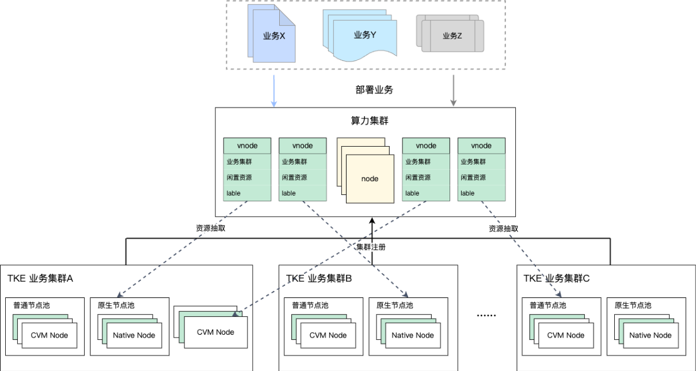
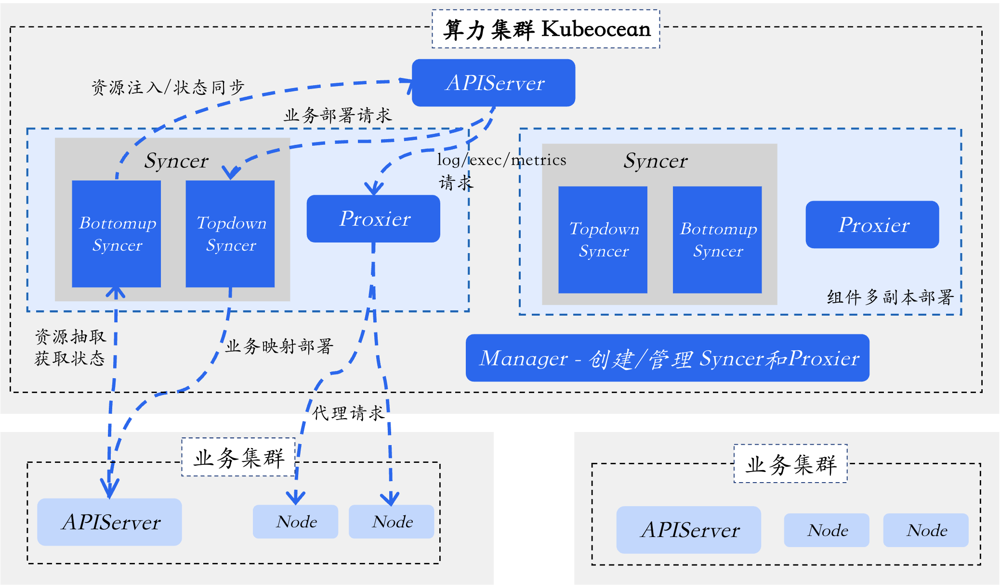

# Kubeocean: Converging Computing Resources Like an Ocean

---

## What is Kubeocean

> English | [中文](README_zh.md)

Kubeocean is an open-source add-ons that dynamically converge cross-cluster computing resources in the form of virtual nodes within a Kubernetes cluster, much like an ocean. This cluster is also referred to as the computing cluster. All Pods deployed on virtual nodes managed by Kubeocean are automatically mapped and synchronized to the corresponding worker clusters for deployment, thereby enabling cross-cluster reuse of computing resources.

---

## Core Features

**Lightweight and Non-intrusive Worker Cluster Registration**

Worker clusters only need to deploy RBAC resources and provide the corresponding kubeconfig to complete registration, without deploying additional components. Kubeocean leverages the granted permissions to automatically complete cluster connection, virtual node registration, and other functions.

**Flexible and Dynamic Resource Extraction and Constraints**

Each worker cluster can flexibly configure the node scope from which computing resources can be extracted, the size and scope of extracted resources, and the time window during which resources can be extracted through `resourceLeasingPolicy`. For example: limit extraction to a maximum of 50% of CPU resources (to avoid affecting online services); only allow resource extraction during weekday nights, available all day on weekends (tidal reuse); only extract node resources with "GPU model A10" (to match model training requirements).

**Global Unified Optimal Scheduling**

Each node with cross-cluster resource extraction is registered as a virtual node on a one-to-one basis, enabling the computing cluster to have a globally unified scheduling view, achieving globally optimal scheduling strategies, minimizing resource fragmentation, and improving resource utilization.

**Native and Seamless Workload Deployment**

Deploying workload in the computing cluster managed by Kubeocean requires no modifications. The component automatically implements native Kubernetes capabilities, deploying, running, and recycling Pods on virtual nodes and their dependent resources (such as configmaps, secrets, etc.) across clusters.

**Minimal Permission Security Control**

Pods mapped and created by Kubeocean in worker clusters are centralized in a single namespace, and all operations on worker clusters are based on the minimal permission kubeconfig granted during registration, minimizing the impact on worker clusters.

---

## Architecture

The overall architecture of Kubeocean is as follows:

**Manager: Worker Cluster Registration and Lifecycle Management**

- Monitors ClusterBinding resource changes
- Automatically creates and manages Syncer components
- Responsible for cluster binding lifecycle management

**Syncer: Resource Extraction and Mapping Synchronization**

Divided into two submodules: Bottomup Syncer and Topdown Syncer:

*Bottomup Syncer: Resource Calculation and Extraction*

- Monitors worker cluster node and Pod status changes
- Calculates extractable resources based on ResourceLeasingPolicy, creates and updates virtual nodes
- Synchronizes Pod status to the computing cluster

*Topdown Syncer: Worker Mapping Deployment*

- Monitors Pod creation in the computing cluster and dispatches to worker clusters for creation
- Maps Pod-dependent resources such as ConfigMap, Secret, PV/PVC to the target worker cluster and updates in real-time
- Manages Pod lifecycle in the computing cluster

**Proxier: Request Proxy**

- Responsible for listening to requests on port 10250 on Vnodes and proxying them to actual physical nodes
- Implements capabilities such as kubectl logs, exec, etc.

---

## Getting Started

Refer to the documentation: [Quick Start](docs/quick-start.md)

---

## Documentation

To be completed

## RoadMap

To be completed

## How to Contribute

To be completed

## Code of Conduct

To be completed
