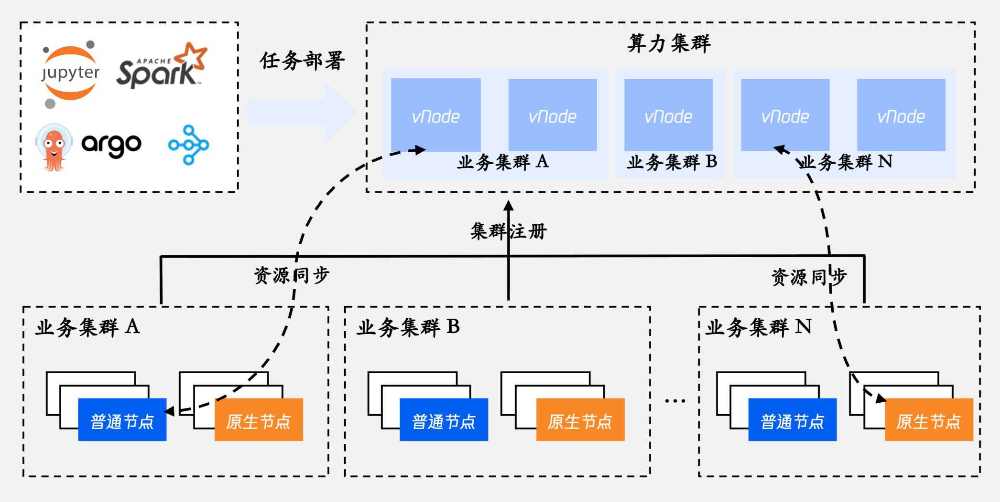
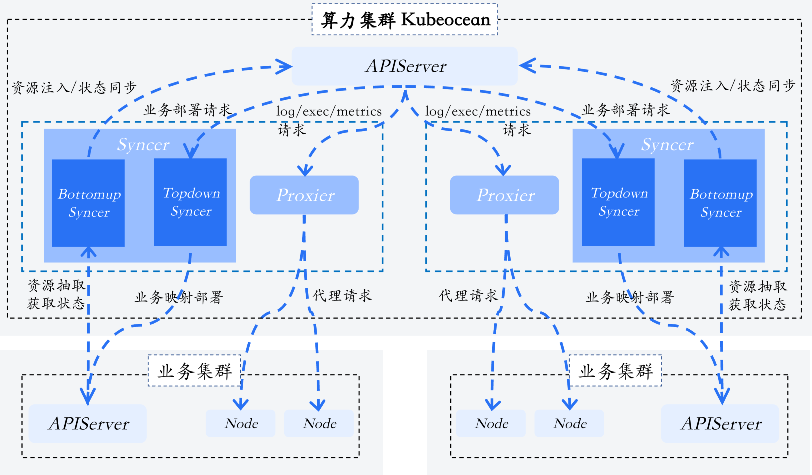
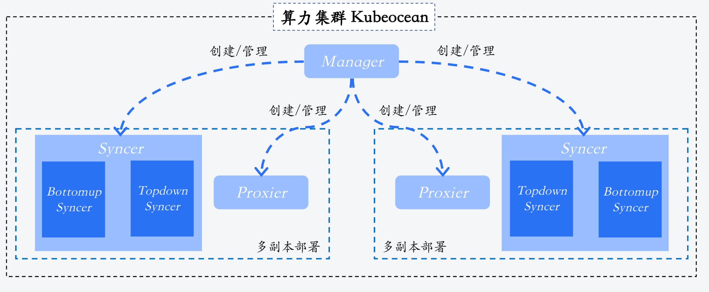

# Kubeocean: Converging Computing Resources Like an Ocean

---

## Kubeocean 是什么

> [English](README.md) | 中文

Kubeocean 是一套开源的插件，支持在一个 kubernetes 集群当中以虚拟节点的形式汇聚跨集群的算力资源，就像一个大海一样，这个集群我们也称为算力集群。所有部署在 Kubeocean 管理的虚拟节点上的 Pod 都会自动映射同步到对应的业务集群上进行部署，从而实现算力资源的跨集群复用。目前算力集群主要给各种离线作业提供服务，如 Spark、argo 等。

---

## 核心特性

**轻量无侵入的业务集群注册**

业务集群只需部署 rbac 相关资源及提供对应的 kubeconfig，无需部署额外组件即可完成注册。Kubeocean 利用授予的权限自动完成集群的连接、虚拟节点注册等功能。

**灵活动态的资源抽取和约束**

每个业务集群都可通过 `resourceLeasingPolicy` 灵活配置该集群可被抽取算力资源的节点范围、抽取资源的大小和范围、以及资源可被抽取的时间窗等。比如：限制最多只能抽取 50% 的 CPU 资源（避免影响在线）； 仅允许工作日夜间抽取资源，周末全天可用（潮汐复用）； 只抽取 “GPU 型号为 A10” 的节点资源（匹配模型训练需求）。

**全局统一实现调度最优**

每个跨集群抽取资源的节点将一比一的注册成虚拟节点，从而使得算力集群具有全局统一的调度视图，能够实现全局最优的调度策略，最大化减少资源碎片，提升资源利用率。

**原生无感的业务部署**

Kubeocean 管理的算力集群中部署业务无需任何改造，组件会自动实现原生 kubernetes 的相关能力，将虚拟节点上的 Pod 和其所依赖的资源（如 configmaps、secrets 等）实现跨集群的部署、运行和回收。

**最小权限的安全管控**

Kubeocean 在业务集群中映射创建的 Pod 集中在一个 namespace 当中，所有对业务集群的操作都基于注册时授予最小权限的 kubeconfig，最大程度的减少对业务集群的影响。

---

## 架构

数据流架构：

控制流架构：

**Manager：业务集群注册和生命周期管理**

- 监听 ClusterBinding 资源变化
- 自动创建和管理 Syncer 组件
- 负责集群绑定的生命周期管理

**Syncer：资源抽取和映射同步**

分为 Bottomup Syncer 和 Topdown Syncer 两个子模块：

*Bottomup Syncer：资源计算和抽取*

- 监听业务集群节点和 Pod 状态变化
- 根据 ResourceLeasingPolicy 计算可抽取资源，创建和更新虚拟节点 
- 同步 Pod 状态到算力集群

*Topdown Syncer：业务映射部署*

- 监听算力集群中的 Pod 创建，下发到业务集群中创建
- 将 Pod 依赖的资源 ConfigMap、Secret、PV/PVC 等映射到目标业务集群，并实时更新
- 管理算力集群中的 Pod 生命周期

**Proxier：请求代理**

- 负责监听 Vnode 上 10250 端口的请求，代理到实际的物理节点
- 实现 kubectl logs、exec 等能力

---

## 开始使用

参考文档： [快速开始](docs/quick-start_zh.md)

---

## 文档

请参见：[文档索引](docs/README_zh.md)
