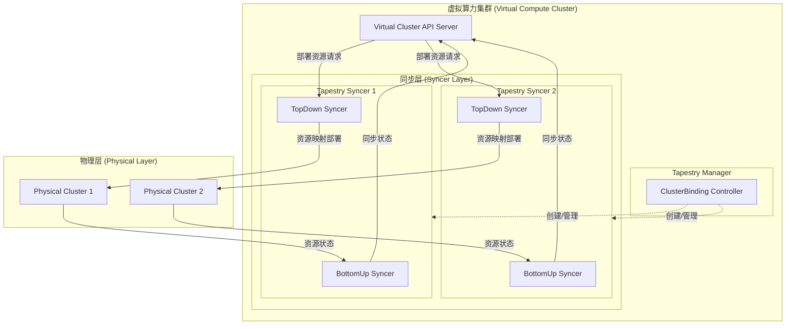

# Tapestry 架构文档

## 1. Overview

Tapestry 是一个 Kubernetes 算力集群项目，通过整合多个物理 Kubernetes 集群的闲置计算资源，形成统一的虚拟算力集群。系统采用控制器模式，实现资源的动态抽取、虚拟节点管理和工作负载调度。

### 核心特性

- **多集群资源整合**: 将多个物理集群的闲置资源整合为统一的虚拟算力池
- **双向资源同步**: 支持从物理集群到虚拟集群的 Bottom-up 同步和从虚拟集群到物理集群的 Top-down 同步
- **智能资源调度**: 基于 ResourceLeasingPolicy 实现时间窗口和资源限制的智能调度
- **高可用设计**: 所有组件支持多副本部署和 Leader Election 机制
- **故障隔离**: 每个物理集群独立的 Syncer 实例，确保单点故障不影响整体系统

### 技术栈

- **语言**: Go 1.24+
- **框架**: Kubernetes Controller Runtime
- **API**: Custom Resource Definitions (CRD)
- **存储**: Kubernetes etcd
- **监控**: Prometheus Metrics + 结构化日志

## 2. 架构图

## 3. 组件介绍

### 3.1 Tapestry Manager

**主要职责**: 中央控制平面组件，负责管理集群绑定

**核心功能**:
- 监听 ClusterBinding 资源变化
- 自动创建和管理 Tapestry Syncer 组件
- 负责集群绑定的生命周期管理

**部署方式**: 支持多副本部署

### 3.2 Tapestry Syncer

**主要职责**: 负责特定物理集群与虚拟集群之间的双向同步

**核心功能**:
- 每个实例专门负责一个物理集群的同步工作
- 通过 Leader Election 机制支持多副本部署
- 包含 Bottom-up Syncer 和 Top-down Syncer 两个子模块
- 独立的故障恢复和扩缩容能力

**部署方式**: 每个物理集群对应一个 Syncer 实例，支持多副本部署

## 4. 子模块详细说明

### 4.1 Tapestry Manager 子模块

#### 4.1.1 ClusterBinding Controller

**职责**: 管理物理集群注册和验证

**主要功能**:
- 处理 ClusterBinding 资源的 CRUD 操作
- 验证集群连接性和权限
- 为每个 ClusterBinding 创建对应的 Tapestry Syncer 实例
- 管理 Syncer 的配置和状态
- 处理集群绑定的生命周期管理

**关键特性**:
- 自动创建 Syncer 的 Deployment、ServiceAccount、ClusterRole 等资源
- 支持集群连接失败的重试机制
- 提供详细的状态管理和事件记录

### 4.2 Tapestry Syncer 子模块

#### 4.2.1 BottomUp Syncer

**职责**: 从物理集群到虚拟集群的资源同步

**主要功能**:
- 监听物理集群节点和 Pod 状态变化
- 根据 ResourceLeasingPolicy 计算可抽取资源
- 创建和更新虚拟节点
- 同步 Pod 状态到虚拟集群

**包含的子模块**:

##### 4.2.1.1 PhysicalNodeReconciler

**职责**: 物理节点控制器，负责虚拟节点的创建和管理

**主要功能**:
- 监听物理集群节点变化
- 根据 ResourceLeasingPolicy 计算可抽取资源
- 创建和更新虚拟节点
- 管理虚拟节点的生命周期
- 处理节点删除和资源回收

**关键特性**:
- 支持节点选择器和资源策略
- 自动计算虚拟节点的资源容量
- 处理节点删除的优雅回收

##### 4.2.1.2 PhysicalPodReconciler

**职责**: 物理 Pod 控制器，负责 Pod 状态同步

**主要功能**:
- 监听物理集群 Pod 状态变化
- 同步 Pod 状态到虚拟集群
- 验证 Pod 的 Tapestry 管理标签
- 处理 Pod 删除和状态更新

**关键特性**:
- 只同步 Tapestry 管理的 Pod
- 确保状态同步的幂等性
- 处理 Pod 删除的优雅处理

##### 4.2.1.3 PhysicalCSINodeReconciler

**职责**: 物理 CSI 节点控制器，负责存储相关节点信息同步

**主要功能**:
- 监听物理集群 CSINode 变化
- 同步 CSI 节点信息到虚拟集群
- 管理虚拟 CSI 节点的生命周期
- 处理存储驱动信息的同步

**关键特性**:
- 支持存储驱动的动态发现
- 确保存储功能的可用性
- 处理 CSI 节点删除的清理

##### 4.2.1.4 ResourceLeasingPolicyReconciler

**职责**: 资源租赁策略控制器，负责策略应用和资源计算

**主要功能**:
- 监听 ResourceLeasingPolicy 变化
- 触发节点重新评估
- 应用资源策略到物理节点
- 管理策略的生命周期

**关键特性**:
- 支持时间窗口和资源限制
- 自动触发节点重新评估
- 处理策略删除的资源回收

##### 4.2.1.5 LeaseController

**职责**: 租约控制器，负责虚拟节点的租约管理

**主要功能**:
- 为每个虚拟节点创建和管理租约
- 定期续约确保节点活跃状态
- 处理租约过期和节点清理
- 支持租约的优雅停止

**关键特性**:
- 自动租约续约机制
- 支持租约过期处理
- 优雅的停止和清理

#### 4.2.2 TopDown Syncer

**职责**: 从虚拟集群到物理集群的资源同步

**主要功能**:
- 监听虚拟集群中的资源创建
- 将资源映射到目标物理集群
- 处理资源名称冲突和命名空间映射
- 维护资源映射关系

**包含的子模块**:

##### 4.2.2.1 VirtualPodReconciler

**职责**: 虚拟 Pod 控制器，负责 Pod 的创建和同步

**主要功能**:
- 监听虚拟集群 Pod 创建
- 在物理集群创建对应的 Pod
- 处理 Pod 删除和生命周期管理
- 维护虚拟 Pod 和物理 Pod 的映射关系

**关键特性**:
- 支持 Pod 的双向映射
- 处理 Pod 删除的优雅清理
- 确保 Pod 创建的幂等性
- 支持 Pod 状态同步

##### 4.2.2.2 VirtualConfigMapReconciler

**职责**: 虚拟 ConfigMap 控制器，负责 ConfigMap 同步

**主要功能**:
- 监听虚拟集群 ConfigMap 创建
- 在物理集群创建对应的 ConfigMap
- 处理 ConfigMap 更新和删除
- 维护 ConfigMap 的映射关系

**关键特性**:
- 支持 ConfigMap 的双向同步
- 处理 ConfigMap 更新的冲突解决
- 确保数据一致性

##### 4.2.2.3 VirtualSecretReconciler

**职责**: 虚拟 Secret 控制器，负责 Secret 同步

**主要功能**:
- 监听虚拟集群 Secret 创建
- 在物理集群创建对应的 Secret
- 处理 Secret 更新和删除
- 维护 Secret 的映射关系

**关键特性**:
- 支持 Secret 的双向同步
- 处理敏感数据的安全传输
- 确保 Secret 数据的一致性

##### 4.2.2.4 VirtualPVCReconciler

**职责**: 虚拟 PVC 控制器，负责 PersistentVolumeClaim 同步

**主要功能**:
- 监听虚拟集群 PVC 创建
- 验证物理集群 PVC 存在性
- 处理 PVC 状态同步
- 维护 PVC 的映射关系

**关键特性**:
- 只同步 vPod 关联的 PVC
- 验证 PVC 绑定状态
- 确保存储资源的一致性

##### 4.2.2.5 VirtualPVReconciler

**职责**: 虚拟 PV 控制器，负责 PersistentVolume 同步

**主要功能**:
- 监听虚拟集群 PV 创建
- 验证物理集群 PV 存在性
- 处理 PV 状态同步
- 维护 PV 的映射关系

**关键特性**:
- 只同步 vPod 关联的 PV
- 验证 PV 的可用性
- 确保存储资源的一致性

### 4.3 核心 API 资源

#### 4.3.1 ClusterBinding

**作用**: 定义物理集群与虚拟集群的绑定关系

**主要字段**:
- `clusterID`: 集群唯一标识符
- `secretRef`: 包含 kubeconfig 的 Secret 引用
- `nodeSelector`: 节点选择器
- `mountNamespace`: 资源挂载命名空间
- `serviceNamespaces`: 服务同步命名空间列表

### 4.4 关键标签和注解

#### 4.4.1 管理标签
- `tapestry.io/managed-by`: 标识 Tapestry 管理的资源
- `tapestry.io/cluster-binding`: 关联的集群绑定
- `tapestry.io/physical-cluster-id`: 物理集群 ID
- `tapestry.io/physical-node-name`: 物理节点名称

#### 4.4.2 映射注解
- `tapestry.io/physical-pod-namespace`: 物理 Pod 命名空间
- `tapestry.io/physical-pod-name`: 物理 Pod 名称
- `tapestry.io/physical-pod-uid`: 物理 Pod UID
- `tapestry.io/virtual-pod-namespace`: 虚拟 Pod 命名空间
- `tapestry.io/virtual-pod-name`: 虚拟 Pod 名称
- `tapestry.io/virtual-pod-uid`: 虚拟 Pod UID

#### 4.4.3 同步注解
- `tapestry.io/last-sync-time`: 最后同步时间
- `tapestry.io/policies-applied`: 应用的策略列表
- `tapestry.io/expected-metadata`: 期望的元数据

### 4.5 高可用性设计

#### 4.5.1 故障隔离
- 每个物理集群独立的 Syncer 实例
- 单个 Syncer 故障不影响其他集群
- 支持 Syncer 的自动重启和恢复

#### 4.5.2 状态管理
- 使用 Kubernetes 原生的状态管理机制
- 支持资源的优雅删除和清理
- 提供详细的错误信息和重试机制

#### 4.5.3 高可用部署
- Tapestry Manager 支持多副本部署
- 每个 Syncer 支持多副本部署
- 支持组件的自动扩缩容

### 4.6 监控和可观测性

#### 4.6.1 指标监控
- Prometheus 指标暴露在 `:8080/metrics`
- 包含集群绑定、同步延迟、错误计数等指标
- 支持自定义指标和告警规则

#### 4.6.2 健康检查
- 存活探针: `:8081/healthz`
- 就绪探针: `:8081/readyz`
- 支持优雅启动和关闭

#### 4.6.3 日志记录
- 结构化日志格式
- 支持不同日志级别
- 包含组件、操作等上下文信息

### 4.7 安全设计

#### 4.7.1 RBAC 权限
- 最小权限原则
- 为每个组件配置专用 ServiceAccount
- 支持权限分离和细粒度控制

#### 4.7.2 网络安全
- 支持 TLS 加密的集群间通信
- 使用 Secret 存储敏感的 kubeconfig 信息
- 支持网络策略和访问控制

#### 4.7.3 资源隔离
- 使用专用命名空间运行组件
- 支持资源配额和限制
- 确保组件间的安全隔离
