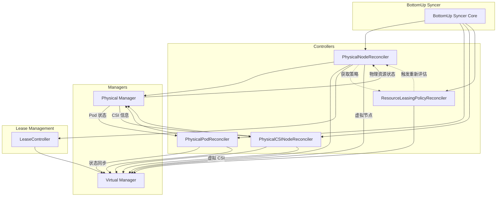
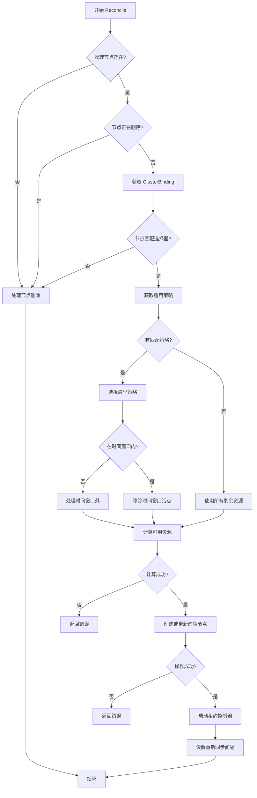
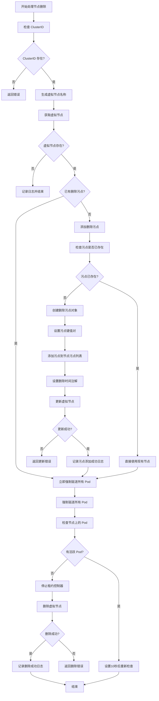
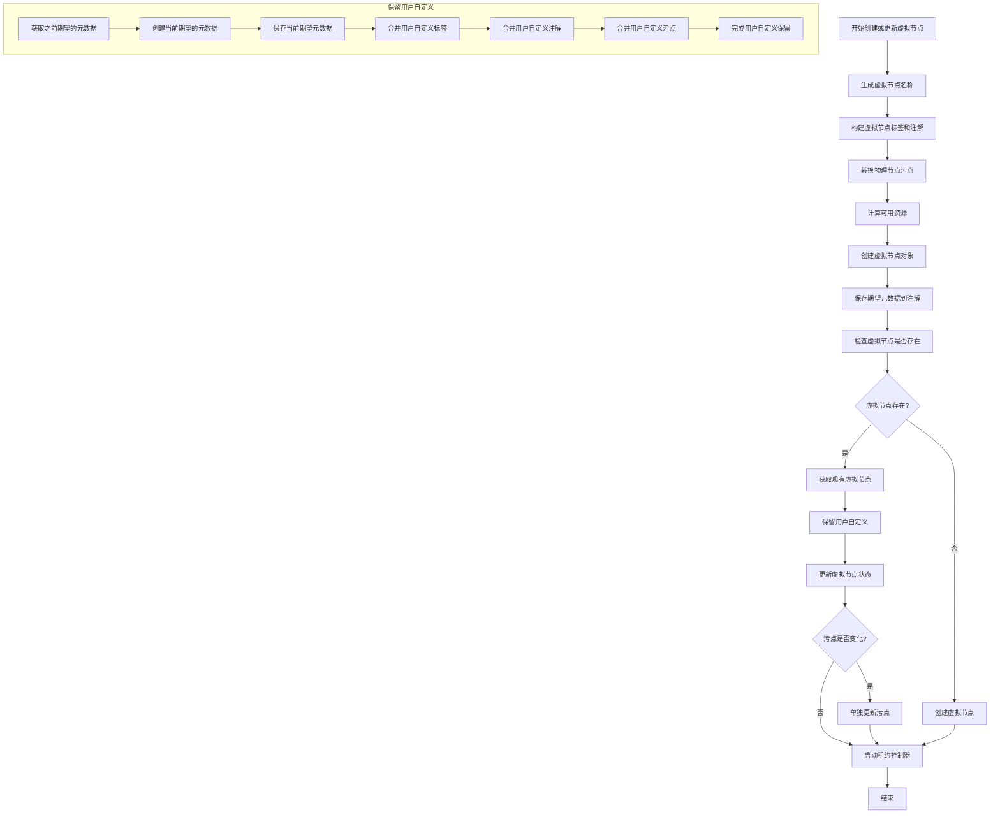
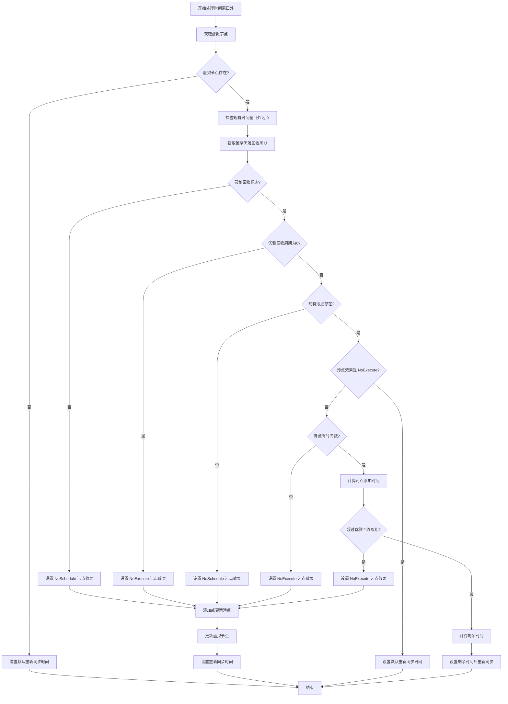
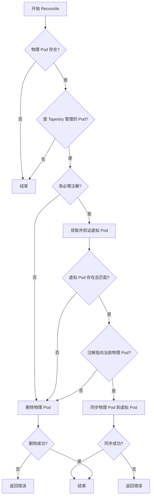

# BottomUp Syncer 组件文档

## 1. 模块概述

### 1.1 组件概述

BottomUp Syncer 是 Tapestry 系统的核心同步组件之一，负责从物理集群到虚拟算力集群的资源同步。它实现了 Kubernetes Controller 模式，通过监听物理集群的资源变化，将相关信息同步到虚拟集群中，为虚拟算力集群提供实时的资源状态信息。

### 1.2 主要职责和功能

- **物理节点同步**: 监听物理集群节点变化，根据 ResourceLeasingPolicy 计算可抽取资源，创建和更新虚拟节点
- **Pod 状态同步**: 监控物理集群中 Tapestry 管理的 Pod 状态变化，同步状态到虚拟集群
- **CSI 节点同步**: 同步物理集群的 CSI 节点信息到虚拟集群，确保存储功能的可用性
- **资源策略管理**: 监听 ResourceLeasingPolicy 变化，触发节点重新评估和资源计算
- **租约管理**: 为每个虚拟节点创建和管理租约，确保节点的活跃状态
- **节点重新评估**: 支持根据策略变化触发特定节点的重新评估和资源计算

## 2. 包含的子模块及相关介绍

### 2.1 PhysicalNodeReconciler

**职责**: 物理节点控制器，负责虚拟节点的创建和管理

**主要功能**:
- 监听物理集群节点变化，根据 ClusterBinding 的节点选择器过滤节点
- 根据 ResourceLeasingPolicy 计算可抽取的资源量
- 创建和更新虚拟节点，包括资源容量、标签和注解
- 管理时间窗口和节点污点，处理策略的时间限制
- 启动和管理虚拟节点的租约控制器

**关键特性**:
- 支持多种资源策略的优先级处理
- 智能的时间窗口管理和污点控制
- 动态资源计算和虚拟节点生命周期管理

### 2.2 PhysicalPodReconciler

**职责**: 物理 Pod 控制器，负责 Pod 状态同步

**主要功能**:
- 监听物理集群 Pod 状态变化，只处理 Tapestry 管理的 Pod
- 验证物理 Pod 的必需注解和标签
- 同步 Pod 状态到对应的虚拟 Pod
- 处理 Pod 删除和状态更新
- 维护物理 Pod 和虚拟 Pod 的映射关系

**关键特性**:
- 只同步 Tapestry 管理的 Pod，避免干扰其他工作负载
- 双向映射验证，确保数据一致性
- 优雅的状态同步和错误处理

### 2.3 PhysicalCSINodeReconciler

**职责**: 物理 CSI 节点控制器，负责存储相关节点信息同步

**主要功能**:
- 监听物理集群 CSINode 变化
- 同步 CSI 节点信息到虚拟集群
- 管理虚拟 CSI 节点的生命周期
- 处理存储驱动信息的同步

**关键特性**:
- 支持存储驱动的动态发现
- 确保存储功能的可用性
- 处理 CSI 节点删除的清理

### 2.4 ResourceLeasingPolicyReconciler

**职责**: 资源租赁策略控制器，负责策略应用和资源计算

**主要功能**:
- 监听 ResourceLeasingPolicy 变化
- 验证策略的时间窗口和资源限制配置
- 触发节点重新评估和资源计算
- 管理策略的生命周期和状态更新

**关键特性**:
- 支持时间窗口和资源限制的验证
- 自动触发节点重新评估
- 处理策略删除的资源回收

### 2.5 LeaseController

**职责**: 租约控制器，负责虚拟节点的租约管理

**主要功能**:
- 为每个虚拟节点创建和管理租约
- 定期续约确保节点活跃状态
- 处理租约过期和节点清理
- 支持租约的优雅停止

**关键特性**:
- 自动租约续约机制
- 支持租约过期处理
- 优雅的停止和清理

## 3. 子模块调用关系图

## 4. PhysicalNodeReconciler 工作流程

### 4.1 主要工作流程图

### 4.2 处理节点删除流程

### 4.3 创建或更新虚拟节点流程

### 4.4 处理时间窗口外流程

## 5. PhysicalPodReconciler 主要工作流程

## 6. 关键逻辑实现细节说明

### 6.1 资源计算机制

PhysicalNodeReconciler 实现了智能的资源计算机制，根据 ResourceLeasingPolicy 动态计算可抽取的资源：

- **策略匹配**: 根据节点选择器匹配适用的 ResourceLeasingPolicy
- **优先级处理**: 当多个策略匹配时，选择创建时间最早的策略
- **时间窗口管理**: 检查策略的时间窗口，在窗口外时添加污点
- **资源计算**: 根据策略的资源限制计算可抽取的 CPU、内存等资源
- **动态调整**: 实时响应策略变化，重新计算资源分配

### 6.2 节点生命周期管理

实现了完整的虚拟节点生命周期管理机制：

- **创建流程**: 根据物理节点和策略创建虚拟节点，设置正确的标签和注解
- **更新机制**: 监听物理节点变化，实时更新虚拟节点的资源信息
- **删除处理**: 当物理节点删除或不匹配选择器时，优雅删除虚拟节点
- **污点管理**: 根据时间窗口状态动态管理节点污点
- **租约维护**: 为每个虚拟节点维护活跃租约，确保节点可用性

### 6.3 Pod 状态同步机制

PhysicalPodReconciler 实现了精确的 Pod 状态同步：

- **过滤机制**: 只处理带有 Tapestry 管理标签的 Pod
- **注解验证**: 验证物理 Pod 包含必需的虚拟 Pod 映射注解
- **双向验证**: 确保虚拟 Pod 的注解正确指向当前物理 Pod
- **状态同步**: 将物理 Pod 的状态信息同步到虚拟 Pod
- **清理机制**: 当映射关系失效时，自动清理物理 Pod

### 6.4 策略触发机制

ResourceLeasingPolicyReconciler 实现了高效的策略触发机制：

- **变化检测**: 监听策略的创建、更新和删除事件
- **节点查找**: 根据策略的节点选择器查找匹配的节点
- **重新评估**: 触发匹配节点的重新评估和资源计算
- **状态更新**: 更新策略的状态信息，包括时间窗口状态
- **生命周期管理**: 处理策略删除时的资源回收

### 6.5 租约管理机制

LeaseController 实现了可靠的租约管理：

- **自动续约**: 定期续约确保虚拟节点的活跃状态
- **过期处理**: 处理租约过期的情况，确保节点状态正确
- **优雅停止**: 支持租约控制器的优雅停止和清理
- **并发控制**: 处理多个租约控制器的并发操作
- **错误恢复**: 在租约操作失败时进行重试和恢复

