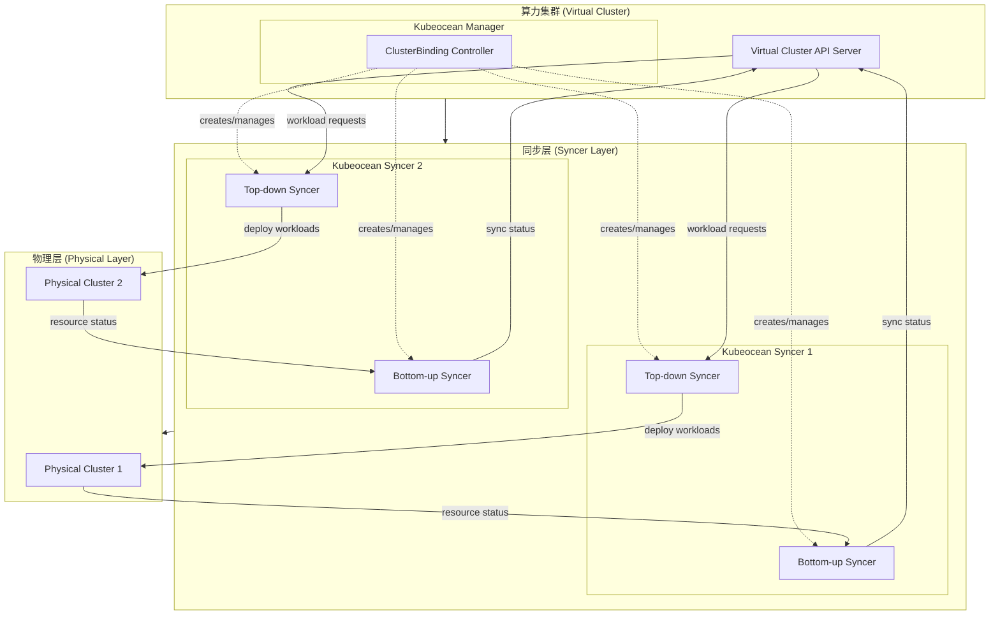

# Kubeocean 设计文档

## Overview

Kubeocean 是一个 Kubernetes 算力集群项目，通过整合多个物理 Kubernetes 集群的闲置计算资源，形成统一的虚拟算力集群。系统采用控制器模式，实现资源的动态抽取、虚拟节点管理和工作负载调度。

## Architecture

### 整体架构



### 核心组件

#### Kubeocean Manager

**职责:**
- 监听 ClusterBinding 和 ResourceLeasingPolicy 资源变化
- 自动创建和管理 Kubeocean Syncer 组件
- 通过 leader election 机制确保高可用性
- 负责集群绑定的生命周期管理

**ClusterBinding Controller 子模块:**
- 处理 ClusterBinding 资源的 CRUD 操作
- 验证集群连接性和权限
- 为每个 ClusterBinding 创建对应的 Kubeocean Syncer 实例
- 管理 Syncer 的配置和状态

#### Kubeocean Syncer

**职责:**
- 每个实例专门负责一个物理集群的同步工作
- 通过 leader election 机制支持多副本部署
- 包含 Bottom-up Syncer 和 Top-down Syncer 两个子模块
- 独立的故障恢复和扩缩容能力

**Bottom-up Syncer 子模块:**
- 监听物理集群节点和 Pod 状态变化
- 根据 ResourceLeasingPolicy 计算可抽取资源
- 创建和更新虚拟节点
- 同步 Pod 状态到虚拟集群
- 确保所有状态同步操作的幂等性

**Top-down Syncer 子模块:**
- 监听虚拟集群中的 Pod、ConfigMap、Secret、Service、PV、PVC 创建
- 将资源映射到目标物理集群
- 处理资源名称冲突和命名空间映射
- 维护资源映射关系
- 只同步 vPod 关联的 PersistentVolume 和 PersistentVolumeClaim
- 确保所有同步操作的幂等性

## Components and Interfaces

### Kubeocean Controller

**职责:**
- 通过 leader election 机制确保多副本部署时只有一个活跃实例
- 监听 ClusterBinding 和 ResourceLeasingPolicy 资源变化
- 为每个 ClusterBinding 启动对应的 syncer 对
- 管理 syncer 生命周期

#### ClusterBinding Controller 子模块

**职责:**
- 处理 ClusterBinding 资源的 CRUD 操作
- 验证集群连接性和权限
- 启动和停止对应的 syncer

**接口:**

```go
// Kubeocean Manager 接口
type KubeoceanManager interface {
    Run(ctx context.Context) error
    IsLeader() bool
}

type ClusterBindingController interface {
    ReconcileClusterBinding(binding *v1beta1.ClusterBinding) error
    CreateSyncer(binding *v1beta1.ClusterBinding) error
    DeleteSyncer(bindingName string) error
    UpdateSyncerConfig(binding *v1beta1.ClusterBinding) error
}

// Kubeocean Syncer 接口
type KubeoceanSyncer interface {
    Run(ctx context.Context) error
    IsLeader() bool
    GetClusterBinding() *v1beta1.ClusterBinding
    GetMetrics() SyncerMetrics
}

type BottomUpSyncer interface {
    Start(ctx context.Context) error
    SyncNodeStatus(node *corev1.Node) error
    SyncPodStatus(pod *corev1.Pod) error
    CalculateAvailableResources(node *corev1.Node, policies []v1beta1.ResourceLeasingPolicy) corev1.ResourceList
}

type TopDownSyncer interface {
    Start(ctx context.Context) error
    SyncPod(vPod *corev1.Pod) error
    SyncConfigMap(cm *corev1.ConfigMap) error
    SyncSecret(secret *corev1.Secret) error
    SyncService(svc *corev1.Service) error
    SyncPersistentVolume(pv *corev1.PersistentVolume) error
    SyncPersistentVolumeClaim(pvc *corev1.PersistentVolumeClaim) error
}

type SyncerMetrics struct {
    ClusterName     string
    NodeCount       int
    PodCount        int
    SyncLatency     time.Duration
    LastSyncTime    time.Time
    ErrorCount      int64
}
```

### Bottom-up Syncer

**职责:**
- 监听物理集群节点和 Pod 状态变化
- 根据 ResourceLeasingPolicy 计算可抽取资源
- 创建和更新虚拟节点
- 同步 Pod 状态到虚拟集群

**接口:**
```go
type BottomUpSyncer interface {
    Start(ctx context.Context) error
    SyncNodeStatus(node *corev1.Node) error
    SyncPodStatus(pod *corev1.Pod) error
    CalculateAvailableResources(node *corev1.Node, policies []v1alpha1.ResourceLeasingPolicy) corev1.ResourceList
}
```

### Top-down Syncer

**职责:**
- 监听虚拟集群中的 Pod、ConfigMap、Secret、Service 创建
- 将资源映射到目标物理集群
- 处理资源名称冲突和命名空间映射
- 维护资源映射关系

**接口:**
```go
type TopDownSyncer interface {
    Start(ctx context.Context) error
    SyncPod(vPod *corev1.Pod) error
    SyncConfigMap(cm *corev1.ConfigMap) error
    SyncSecret(secret *corev1.Secret) error
    SyncService(svc *corev1.Service) error
}
```

## Data Models

### ClusterBinding CRD

```yaml
apiVersion: apiextensions.k8s.io/v1
kind: CustomResourceDefinition
metadata:
  name: clusterbindings.cloud.tencent.com
spec:
  group: cloud.tencent.com
  versions:
  - name: v1beta1
    schema:
      openAPIV3Schema:
        type: object
        properties:
          spec:
            type: object
            properties:
              secretRef:
                type: object
                description: "Reference to secret containing kubeconfig"
                properties:
                  name:
                    type: string
                    description: "Name of the secret"
                  namespace:
                    type: string
                    description: "Namespace of the secret"
                required:
                - name
                - namespace
              nodeSelector:
                type: object
                description: "Selector for nodes to monitor (using v1.NodeSelector)"
              mountNamespace:
                type: string
                description: "Namespace to mount cluster resources"
              serviceNamespaces:
                type: array
                items:
                  type: string
                description: "Namespaces to sync services from"
          status:
            type: object
            properties:
              phase:
                type: string
                enum: ["Pending", "Ready", "Failed"]
              conditions:
                type: array
                items:
                  type: object
                  properties:
                    type:
                      type: string
                    status:
                      type: string
                    reason:
                      type: string
                    message:
                      type: string
```

### ResourceLeasingPolicy CRD

```yaml
apiVersion: apiextensions.k8s.io/v1
kind: CustomResourceDefinition
metadata:
  name: resourceleasingpolicies.cloud.tencent.com
spec:
  group: cloud.tencent.com
  versions:
  - name: v1beta1
    schema:
      openAPIV3Schema:
        type: object
        properties:
          spec:
            type: object
            properties:
              cluster:
                type: string
                description: "Reference to ClusterBinding"
              nodeSelector:
                type: object
                description: "Selector for nodes to apply policy (using v1.NodeSelector)"
              timeWindows:
                type: array
                items:
                  type: object
                  properties:
                    start:
                      type: string
                      format: time
                    end:
                      type: string
                      format: time
                    days:
                      type: array
                      items:
                        type: string
              resourceLimits:
                type: array
                description: "List of resource limits"
                items:
                  type: object
                  properties:
                    resource:
                      type: string
                      description: "Resource name (e.g., cpu, memory, storage)"
                    quantity:
                      type: string
                      description: "Resource quantity (e.g., 4, 8Gi, 100Gi)"
                    percent:
                      type: integer
                      description: "Percentage of the resource to borrow"
                  required:
                  - resource
              forceReclaim:
                type: boolean
                description: "Kill compute pod force when time window is not active"
              gracefulReclaimPeriodSeconds:
                type: integer
                description: "Graceful period of reclaiming resources"
```

### Kubeconfig Secret

ClusterBinding 通过 secretRef 引用包含 kubeconfig 的 Secret 资源：

```yaml
apiVersion: v1
kind: Secret
metadata:
  name: cluster-1-kubeconfig
  namespace: kubeocean-system
type: Opaque
data:
  kubeconfig: <base64-encoded-kubeconfig>
```

**说明:**
- Secret 中的 kubeconfig 文件名固定为 "kubeconfig"
- kubeconfig 内容需要 base64 编码存储
- Controller 会从指定的 namespace 和 name 读取 Secret
- 支持 Secret 的动态更新和热重载

### 虚拟节点数据模型

虚拟节点基于标准 Kubernetes Node 资源，但包含特殊的标签和注解：

```yaml
apiVersion: v1
kind: Node
metadata:
  name: vnode-worker-abc123
  labels:
    kubeocean.io/cluster-id: "cluster-1"
    kubeocean.io/physical-node: "worker-node-1"
    kubeocean.io/node-type: "virtual"
  annotations:
    kubeocean.io/cluster-binding: "cluster-1-binding"
    kubeocean.io/resource-policy: "policy-1,policy-2"
spec:
  # 基于物理节点和策略计算的可用资源
status:
  capacity:
    cpu: "4"
    memory: "8Gi"
  allocatable:
    cpu: "3.5"
    memory: "7Gi"
```

## Idempotency Design

### 幂等性原则

所有同步操作都必须确保幂等性，即重复执行相同操作不会改变最终结果。

#### Bottom-up 同步幂等性

1. **节点状态同步**: 
   - 使用资源版本（ResourceVersion）检查，只在版本变化时更新
   - 比较节点状态差异，只更新变化的字段
   - 使用 Patch 操作而非 Update 操作

2. **Pod 状态同步**:
   - 检查 Pod 状态变化，只同步实际变化的状态
   - 使用时间戳和状态哈希值避免重复同步
   - 处理 Pod 删除的幂等性，避免重复删除操作

#### Top-down 同步幂等性

1. **资源创建幂等性**:
   - 创建前检查资源是否已存在
   - 使用 CreateOrUpdate 模式处理资源创建
   - 通过 annotation 记录资源映射关系，避免重复创建

2. **资源更新幂等性**:
   - 比较资源 spec 差异，只在有变化时更新
   - 使用 Strategic Merge Patch 进行精确更新
   - 保留物理集群中的本地修改，只同步必要字段

3. **PV/PVC 同步幂等性**:
   - 只同步 vPod 实际使用的 PV/PVC
   - 检查 PVC 绑定状态，避免重复创建
   - 处理 PV 回收策略的幂等性

#### 实现策略

```go
type IdempotentSyncer struct {
    resourceCache map[string]string // 资源哈希缓存
    lastSyncTime  map[string]time.Time
}

func (s *IdempotentSyncer) SyncResource(resource interface{}) error {
    resourceKey := generateResourceKey(resource)
    resourceHash := calculateResourceHash(resource)
    
    // 检查是否需要同步
    if s.resourceCache[resourceKey] == resourceHash {
        return nil // 无变化，跳过同步
    }
    
    // 执行同步操作
    err := s.doSync(resource)
    if err == nil {
        s.resourceCache[resourceKey] = resourceHash
        s.lastSyncTime[resourceKey] = time.Now()
    }
    
    return err
}
```

## Error Handling

### 连接错误处理

1. **集群连接失败**: 使用指数退避重试机制，最大重试间隔 5 分钟
2. **权限不足**: 更新 ClusterBinding 状态，记录详细错误信息
3. **网络分区**: 自动检测并在恢复后重新同步状态

### 资源同步错误

1. **资源冲突**: 使用哈希后缀解决命名冲突
2. **同步失败**: 实现重试队列，支持指数退避
3. **数据不一致**: 提供手动修复命令和自动检测机制

### 高可用性错误处理

1. **Leader 选举失败**: 记录错误日志，继续参与选举
2. **Syncer 崩溃**: 自动重启机制，保持状态一致性
3. **资源泄漏**: 定期清理孤儿资源

## Testing Strategy

### 单元测试

1. **Controller 逻辑测试**: 使用 fake client 测试控制器逻辑
2. **资源计算测试**: 验证资源抽取算法的正确性
3. **同步逻辑测试**: 测试双向同步的各种场景

### 集成测试

1. **多集群环境**: 使用 envtest 创建多个测试集群
2. **故障注入**: 模拟网络分区、节点故障等场景
3. **性能测试**: 测试大规模集群的同步性能

### E2E 测试

1. **完整工作流**: 从集群注册到工作负载调度的端到端测试
2. **高可用性测试**: 验证 leader election 和故障恢复
3. **资源管理测试**: 验证资源抽取和虚拟节点管理

## Security Considerations

### 认证和授权

1. **Kubeconfig 安全**: 使用 Secret 存储敏感的 kubeconfig 信息
2. **RBAC 权限**: 为每个组件配置最小权限原则
3. **网络安全**: 支持 TLS 加密的集群间通信

### 资源隔离

1. **命名空间隔离**: 使用专用命名空间运行 Kubeocean 组件
2. **资源配额**: 限制虚拟集群的资源使用
3. **网络策略**: 控制组件间的网络访问

## Scalability and Performance Optimization

### 架构可扩展性优化

#### 分布式架构优势

1. **专用同步**: 每个 Kubeocean Syncer 专门负责一个物理集群，避免资源竞争
2. **故障隔离**: 单个 Syncer 故障不影响其他集群的同步
3. **独立扩展**: 每个 Syncer 支持多副本部署和独立的 leader election
4. **负载分散**: 避免单点压力，提高系统整体性能

#### 高可用性设计

1. **Kubeocean Manager 高可用**: 支持多副本部署，通过 leader election 确保唯一活跃实例
2. **Kubeocean Syncer 高可用**: 每个 Syncer 支持多副本，独立的 leader election 机制
3. **故障自愈**: Manager 检测到 Syncer 故障时自动重新创建
4. **配置同步**: 所有副本共享相同的 ClusterBinding 配置

#### 自动化管理

1. **自动创建**: ClusterBinding Controller 自动为每个集群创建对应的 Kubeocean Syncer
2. **配置更新**: ClusterBinding 变更时自动更新对应 Syncer 的配置
3. **生命周期管理**: 自动处理 Syncer 的创建、更新、删除操作
4. **健康检查**: 定期检查 Syncer 状态并进行故障恢复

### 资源同步优化

1. **批量操作**: 批量处理资源更新以减少 API 调用
2. **增量同步**: 只同步变化的资源，避免全量同步
3. **缓存机制**: 使用本地缓存减少对 API Server 的压力
4. **分页查询**: 对大量资源使用分页查询避免内存溢出


### 部署建议

#### 标准部署架构

**Kubeocean Manager 部署:**
- 推荐 3 副本部署确保高可用性
- 使用 leader election 确保只有一个活跃实例
- 部署在虚拟集群的控制平面节点

**Kubeocean Syncer 部署:**
- 每个物理集群对应一个 Syncer 实例
- 每个 Syncer 推荐 2-3 副本部署
- 可以部署在虚拟集群或独立的管理集群中

#### 资源配置建议

**小规模集群（< 100 节点）:**
```yaml
resources:
  requests:
    cpu: 100m
    memory: 128Mi
  limits:
    cpu: 500m
    memory: 512Mi
```

**中等规模集群（100-1000 节点）:**
```yaml
resources:
  requests:
    cpu: 200m
    memory: 256Mi
  limits:
    cpu: 1000m
    memory: 1Gi
```

**大规模集群（> 1000 节点）:**
```yaml
resources:
  requests:
    cpu: 500m
    memory: 512Mi
  limits:
    cpu: 2000m
    memory: 2Gi
```

## Monitoring and Observability

### 监控指标

1. **系统指标**: CPU、内存、网络使用率
2. **业务指标**: 同步延迟、资源利用率、调度成功率
3. **错误指标**: 失败次数、重试次数、错误类型分布

### 日志记录

1. **结构化日志**: 使用 JSON 格式记录关键事件
2. **日志级别**: 支持动态调整日志级别
3. **审计日志**: 记录所有资源操作的审计信息

### 分布式追踪

1. **请求追踪**: 使用 OpenTelemetry 追踪跨组件请求
2. **性能分析**: 识别性能瓶颈和优化点
3. **错误追踪**: 快速定位和诊断错误原因