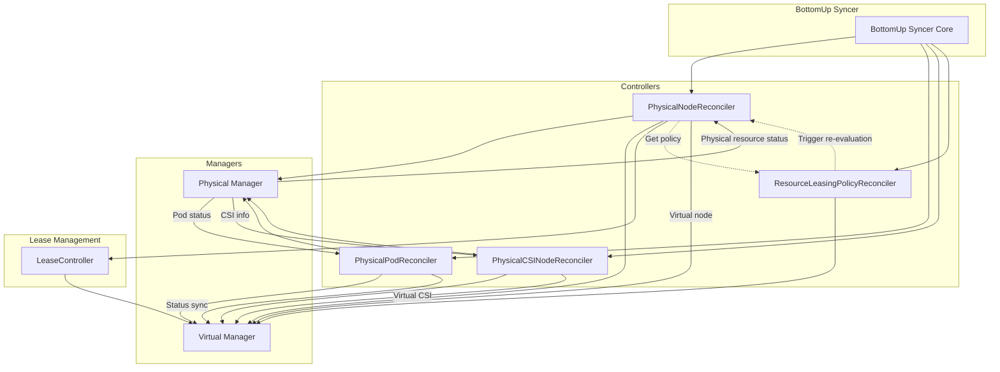
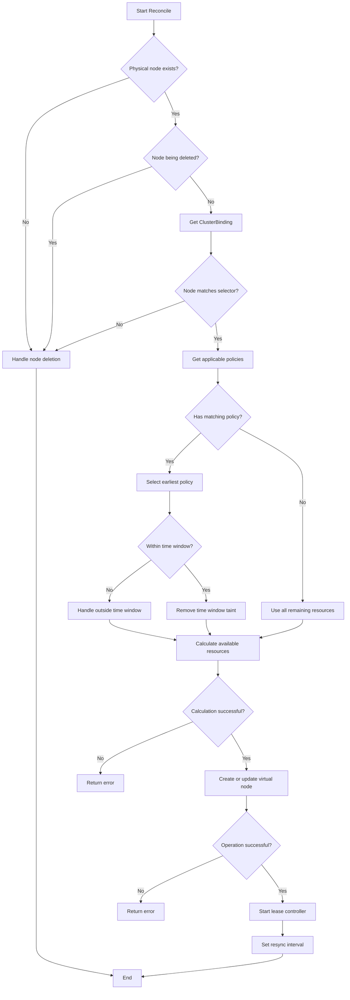
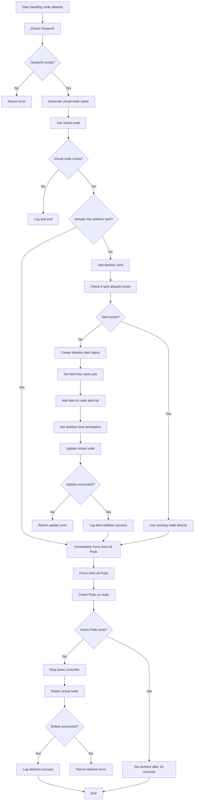
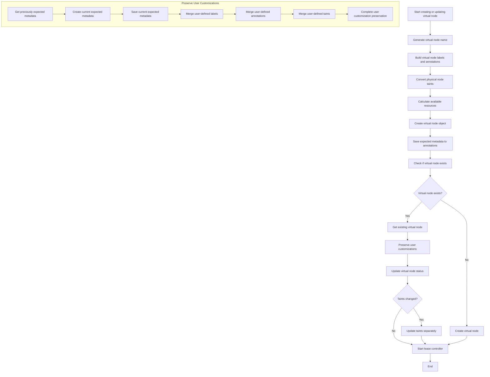
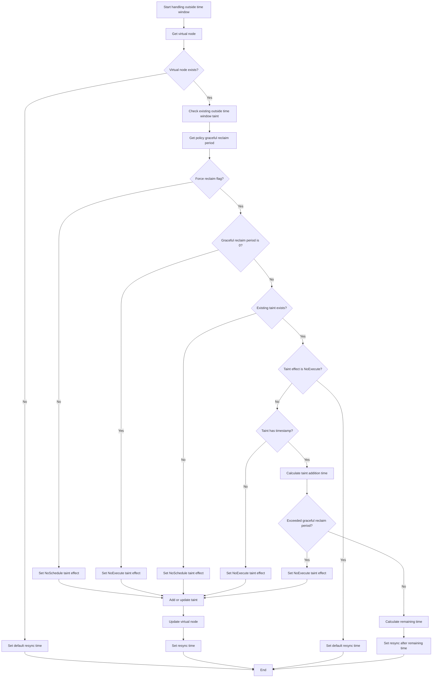
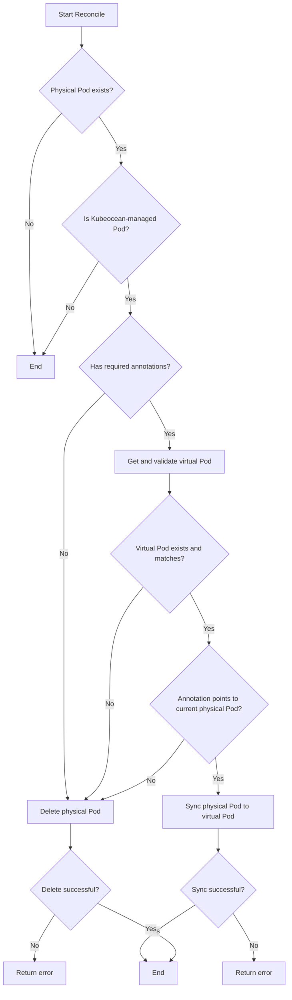

# BottomUp Syncer Component Documentation

## 1. Module Overview

### 1.1 Component Overview

BottomUp Syncer is one of the core synchronization components of the Kubeocean system, responsible for resource synchronization from physical clusters to virtual computing clusters. It implements the Kubernetes Controller pattern, monitoring resource changes in physical clusters and synchronizing relevant information to virtual clusters, providing real-time resource status information for the virtual computing cluster.

### 1.2 Main Responsibilities and Functions

- **Physical Node Synchronization**: Monitor physical cluster node changes, calculate extractable resources based on ResourceLeasingPolicy, create and update virtual nodes
- **Pod Status Synchronization**: Monitor Pod status changes managed by Kubeocean in physical clusters, synchronize status to virtual clusters
- **CSI Node Synchronization**: Synchronize physical cluster CSI node information to virtual clusters, ensure storage functionality availability
- **Resource Policy Management**: Monitor ResourceLeasingPolicy changes, trigger node re-evaluation and resource calculation
- **Lease Management**: Create and manage leases for each virtual node, ensure node active status
- **Node Re-evaluation**: Support triggering re-evaluation and resource calculation of specific nodes based on policy changes

## 2. Included Submodules and Related Introduction

### 2.1 PhysicalNodeReconciler

**Responsibility**: Physical node controller, responsible for virtual node creation and management

**Main Functions**:
- Monitor physical cluster node changes, filter nodes based on ClusterBinding node selectors
- Calculate extractable resource amounts based on ResourceLeasingPolicy
- Create and update virtual nodes, including resource capacity, labels, and annotations
- Manage time windows and node taints, handle policy time constraints
- Start and manage virtual node lease controllers

**Key Features**:
- Support priority handling of multiple resource policies
- Intelligent time window management and taint control
- Dynamic resource calculation and virtual node lifecycle management

### 2.2 PhysicalPodReconciler

**Responsibility**: Physical Pod controller, responsible for Pod status synchronization

**Main Functions**:
- Monitor physical cluster Pod status changes, only process Kubeocean-managed Pods
- Validate required annotations and labels of physical Pods
- Synchronize Pod status to corresponding virtual Pods
- Handle Pod deletion and status updates
- Maintain mapping relationships between physical and virtual Pods

**Key Features**:
- Only synchronize Kubeocean-managed Pods, avoid interfering with other workloads
- Bidirectional mapping validation, ensure data consistency
- Graceful status synchronization and error handling

### 2.3 PhysicalCSINodeReconciler

**Responsibility**: Physical CSI node controller, responsible for storage-related node information synchronization

**Main Functions**:
- Monitor physical cluster CSINode changes
- Synchronize CSI node information to virtual clusters
- Manage virtual CSI node lifecycle
- Handle storage driver information synchronization

**Key Features**:
- Support dynamic discovery of storage drivers
- Ensure storage functionality availability
- Handle cleanup of CSI node deletion

### 2.4 ResourceLeasingPolicyReconciler

**Responsibility**: Resource leasing policy controller, responsible for policy application and resource calculation

**Main Functions**:
- Monitor ResourceLeasingPolicy changes
- Validate policy time windows and resource limit configurations
- Trigger node re-evaluation and resource calculation
- Manage policy lifecycle and status updates

**Key Features**:
- Support validation of time windows and resource limits
- Automatically trigger node re-evaluation
- Handle resource reclamation on policy deletion

### 2.5 LeaseController

**Responsibility**: Lease controller, responsible for virtual node lease management

**Main Functions**:
- Create and manage leases for each virtual node
- Periodically renew leases to ensure node active status
- Handle lease expiration and node cleanup
- Support graceful lease termination

**Key Features**:
- Automatic lease renewal mechanism
- Support lease expiration handling
- Graceful termination and cleanup

## 3. Submodule Call Relationship Diagram

## 4. PhysicalNodeReconciler Workflow

### 4.1 Main Workflow Diagram

### 4.2 Handle Node Deletion Workflow

### 4.3 Create or Update Virtual Node Workflow

### 4.4 Handle Outside Time Window Workflow

## 5. PhysicalPodReconciler Main Workflow

## 6. Key Logic Implementation Details

### 6.1 Resource Calculation Mechanism

PhysicalNodeReconciler implements an intelligent resource calculation mechanism that dynamically calculates extractable resources based on ResourceLeasingPolicy:

- **Policy Matching**: Match applicable ResourceLeasingPolicy based on node selectors
- **Priority Handling**: When multiple policies match, select the earliest created policy
- **Time Window Management**: Check policy time windows, add taints when outside windows
- **Resource Calculation**: Calculate extractable CPU, memory, and other resources based on policy resource limits
- **Dynamic Adjustment**: Respond to policy changes in real-time, recalculate resource allocation

### 6.2 Node Lifecycle Management

A complete virtual node lifecycle management mechanism is implemented:

- **Creation Process**: Create virtual nodes based on physical nodes and policies, set correct labels and annotations
- **Update Mechanism**: Monitor physical node changes, update virtual node resource information in real-time
- **Deletion Handling**: Gracefully delete virtual nodes when physical nodes are deleted or don't match selectors
- **Taint Management**: Dynamically manage node taints based on time window status
- **Lease Maintenance**: Maintain active leases for each virtual node, ensure node availability

### 6.3 Pod Status Synchronization Mechanism

PhysicalPodReconciler implements precise Pod status synchronization:

- **Filtering Mechanism**: Only process Pods with Kubeocean management labels
- **Annotation Validation**: Validate that physical Pods contain required virtual Pod mapping annotations
- **Bidirectional Validation**: Ensure virtual Pod annotations correctly point to current physical Pod
- **Status Synchronization**: Synchronize physical Pod status information to virtual Pods
- **Cleanup Mechanism**: Automatically clean up physical Pods when mapping relationships become invalid

### 6.4 Policy Trigger Mechanism

ResourceLeasingPolicyReconciler implements an efficient policy trigger mechanism:

- **Change Detection**: Monitor policy create, update, and delete events
- **Node Lookup**: Find matching nodes based on policy node selectors
- **Re-evaluation**: Trigger re-evaluation and resource calculation of matching nodes
- **Status Updates**: Update policy status information, including time window status
- **Lifecycle Management**: Handle resource reclamation when policies are deleted

### 6.5 Lease Management Mechanism

LeaseController implements reliable lease management:

- **Automatic Renewal**: Periodically renew leases to ensure virtual node active status
- **Expiration Handling**: Handle lease expiration situations, ensure correct node status
- **Graceful Termination**: Support graceful termination and cleanup of lease controllers
- **Concurrency Control**: Handle concurrent operations of multiple lease controllers
- **Error Recovery**: Retry and recover when lease operations fail

