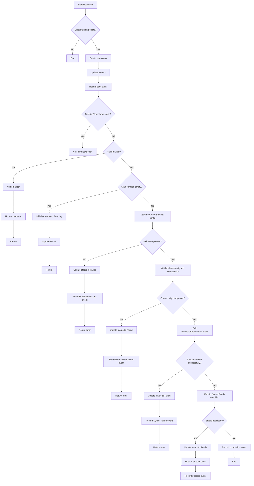
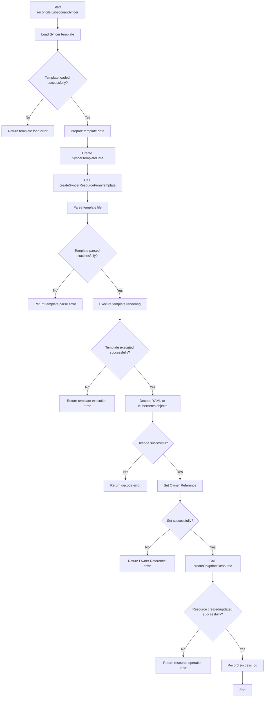
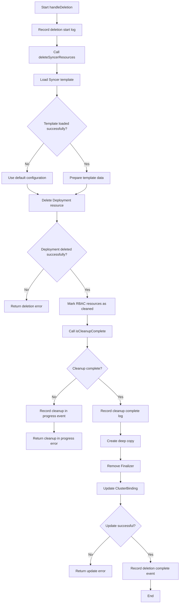

# Kubeocean Manager Component Documentation

## 1. Kubeocean Manager Component Introduction

### 1.1 Component Overview

Kubeocean Manager is the central control plane component of the Kubeocean system, responsible for managing the binding relationship between physical clusters and virtual computing clusters. It is the core management component of the entire system, implementing automated management of cluster resources through the Kubernetes Controller pattern.

### 1.2 Main Responsibilities and Functions

- **Cluster Binding Management**: Monitor and manage the lifecycle of ClusterBinding resources, including create, update, and delete operations
- **Syncer Instance Management**: Automatically create and manage corresponding Kubeocean Syncer instances for each ClusterBinding, including automated deployment of Deployments
- **Connectivity Verification**: Validate physical cluster connectivity and permissions, check kubeconfig validity and target cluster reachability
- **State Management**: Maintain detailed status and conditions of ClusterBindings, monitor and update status information in real-time
- **Resource Cleanup**: Handle resource cleanup when ClusterBinding is deleted, ensure complete resource cleanup
- **Event Recording**: Record Kubernetes events for all important operations, provide operation audit and troubleshooting
- **Metrics Collection**: Provide Prometheus metrics for monitoring and alerting, support system performance monitoring

### 1.4 Deployment Method

- **Multi-replica Deployment**: Support multi-replica deployment to ensure high availability
- **Leader Election**: Implement Leader Election mechanism through Kubernetes Lease resources
- **Graceful Shutdown**: Support graceful startup and shutdown process
- **Health Checks**: Provide liveness and readiness probes

## 2. Core Module ClusterBindingReconciler

### 2.1 Module Overview

ClusterBindingReconciler is the core controller of Kubeocean Manager, responsible for handling the complete lifecycle management of ClusterBinding resources. It implements the Kubernetes Controller pattern, monitoring changes to ClusterBinding resources through the watch mechanism and executing corresponding reconciliation operations.

### 2.2 Main Responsibilities and Functions

- **Resource Reconciliation**: Ensure the desired state of ClusterBinding is consistent with the actual state, handle resource creation, update, and deletion
- **Validation Checks**: Validate the validity and completeness of ClusterBinding configuration, including required field and format validation
- **Connection Testing**: Test connectivity with the target physical cluster, validate the existence and validity of kubeconfig Secret
- **Syncer Management**: Create, update, and manage Kubeocean Syncer instances, render Kubernetes resources using templates
- **Status Updates**: Maintain ClusterBinding status and condition information, reflect resource status in real-time
- **Resource Cleanup**: Handle cleanup when ClusterBinding is deleted, ensure complete resource cleanup
- **Event Recording**: Record key events for all operations, provide operation audit and troubleshooting

## 3. ClusterBindingReconciler Main Workflow

## 4. reconcileKubeoceanSyncer Main Workflow

## 5. handleDeletion Main Workflow

## 6. Implementation Details

### 6.1 Configuration Validation Mechanism

ClusterBindingReconciler implements a strict configuration validation mechanism to ensure the completeness and validity of ClusterBinding resource configuration. The validation process includes:

- **ClusterID Validation**: Check if the cluster identifier is empty, ensure each cluster binding has a unique identifier
- **SecretRef Validation**: Validate kubeconfig Secret reference information, including name and namespace
- **MountNamespace Validation**: Ensure mount namespace is specified, which is necessary configuration for resource synchronization
- **ServiceNamespaces Validation**: Check if each element in the service namespace list is an empty string

When validation fails, it immediately returns an error, updates the ClusterBinding status to Failed, and records the corresponding error event.

### 6.2 Connectivity Testing Mechanism

A complete cluster connectivity testing mechanism is implemented to ensure successful connection to the target physical cluster:

- **kubeconfig Reading**: Securely read kubeconfig data from the specified Secret
- **Format Validation**: Validate if the kubeconfig format is correct, ensure it can be parsed into valid configuration
- **Connection Testing**: Create Kubernetes client and test API connection with the target cluster
- **Permission Validation**: Attempt to execute basic API operations to validate sufficient permissions
- **Timeout Control**: Set 30-second connection timeout to avoid long-term blocking

When connectivity testing fails, detailed error information is recorded to help users quickly identify network or permission issues.

### 6.3 Template Rendering Mechanism

Use Go template engine to implement dynamic creation of Kubernetes resources, providing a flexible and secure resource management approach:

- **Template Loading**: Load predefined Kubernetes resource templates from the file system
- **Data Preparation**: Prepare data required for template rendering based on ClusterBinding configuration
- **Template Parsing**: Parse template files using Go's template package
- **Dynamic Rendering**: Inject configuration data into templates to generate final YAML content
- **Object Decoding**: Decode rendered YAML into Kubernetes objects
- **Ownership Setting**: Set Owner Reference for created resources to establish dependency relationships between resources

This mechanism ensures consistency and maintainability of resource creation while supporting flexible configuration customization.

### 6.4 Resource Cleanup Mechanism

Implement an intelligent resource cleanup strategy to ensure proper cleanup of related resources when ClusterBinding is deleted:

- **Selective Cleanup**: Only delete Deployment resources, preserve RBAC resources for reuse
- **Fallback Mechanism**: Support resource lookup and deletion with multiple naming patterns
- **Status Tracking**: Track cleanup status of each resource, ensure all resources are properly handled
- **Graceful Handling**: Handle cases where resources do not exist, avoid errors due to already deleted resources
- **Completion Check**: Verify all resources that need to be cleaned up have been successfully deleted

This cleanup strategy ensures complete resource cleanup while avoiding unnecessary resource deletion, improving system stability.

These implementation details ensure the reliability, security, and maintainability of Kubeocean Manager, providing a solid management foundation for the entire Kubeocean system.

