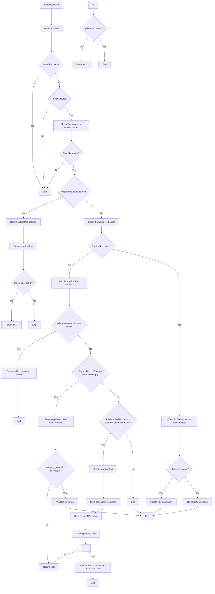
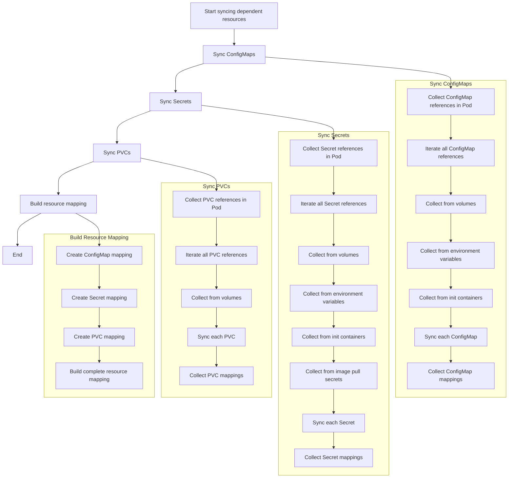
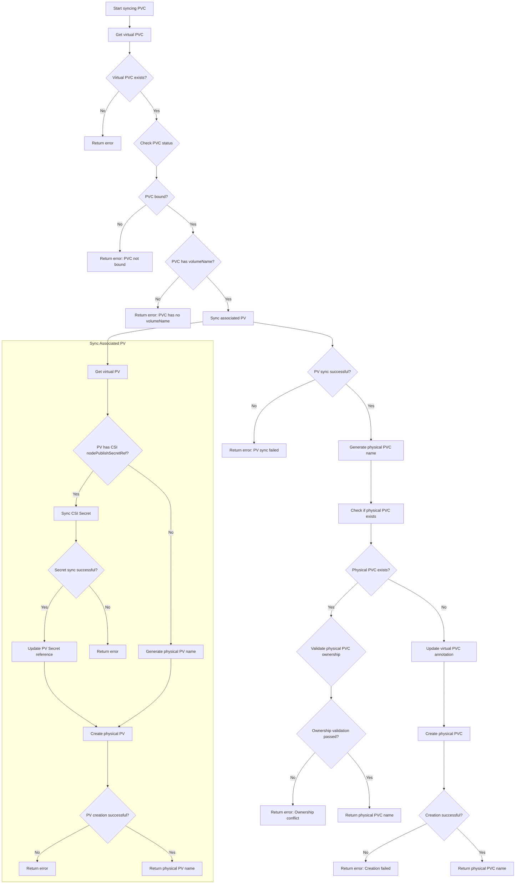
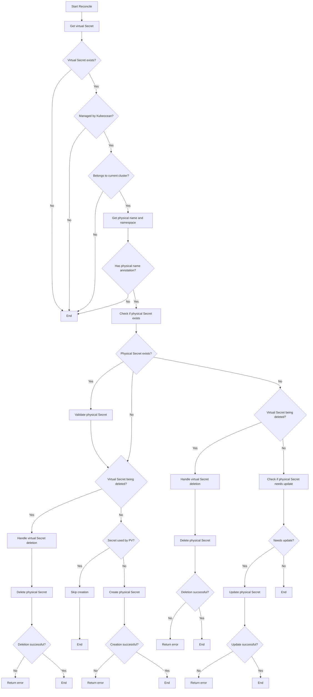

# TopDown Syncer Module Documentation

## 1. Module Overview

TopDown Syncer is one of the core components of the Kubeocean system, responsible for synchronizing resources from the virtual cluster to physical clusters. It implements top-down synchronization from virtual clusters to physical clusters, ensuring that resources created in the virtual cluster are correctly mapped and deployed to physical clusters.

### Main Responsibilities and Functions

- **Resource Synchronization**: Monitor resource changes in virtual clusters, synchronize virtual resources to physical clusters
- **State Management**: Maintain mapping relationships between virtual and physical resources
- **Lifecycle Management**: Handle creation, update, and deletion operations of virtual resources
- **Cross-cluster Coordination**: Establish resource mapping relationships between virtual and physical clusters
- **Annotation Management**: Maintain association relationships between resources through annotation mechanisms

## 2. Included Submodules and Related Introduction

### 2.1 VirtualPodReconciler

**Responsibility**: Responsible for synchronization management of virtual Pods, mapping Pods from virtual clusters to physical clusters.

**Main Functions**:
- Monitor Pod changes in virtual clusters
- Validate if Pods should be managed by the current cluster binding
- Create, update, and delete physical Pods
- Maintain mapping relationships between virtual and physical Pods
- Handle Pod status synchronization and lifecycle management

### 2.2 VirtualConfigMapReconciler

**Responsibility**: Responsible for synchronization management of virtual ConfigMaps, mapping ConfigMaps from virtual clusters to physical clusters.

**Main Functions**:
- Monitor ConfigMap changes in virtual clusters
- Validate if ConfigMaps should be managed by the current cluster binding
- Create, update, and delete physical ConfigMaps
- Maintain mapping relationships between virtual and physical ConfigMaps

### 2.3 VirtualSecretReconciler

**Responsibility**: Responsible for synchronization management of virtual Secrets, mapping Secrets from virtual clusters to physical clusters.

**Main Functions**:
- Monitor Secret changes in virtual clusters
- Validate if Secrets should be managed by the current cluster binding
- Create, update, and delete physical Secrets
- Maintain mapping relationships between virtual and physical Secrets
- Handle Secret data synchronization and validation

### 2.4 VirtualPVCReconciler

**Responsibility**: Responsible for synchronization management of virtual PVCs (PersistentVolumeClaims), mapping PVCs from virtual clusters to physical clusters.

**Main Functions**:
- Monitor PVC changes in virtual clusters
- Validate if PVCs should be managed by the current cluster binding
- Create, update, and delete physical PVCs
- Maintain mapping relationships between virtual and physical PVCs

### 2.5 VirtualPVReconciler

**Responsibility**: Responsible for synchronization management of virtual PVs (PersistentVolumes), mapping PVs from virtual clusters to physical clusters.

**Main Functions**:
- Monitor PV changes in virtual clusters
- Validate if PVs should be managed by the current cluster binding
- Create, update, and delete physical PVs
- Maintain mapping relationships between virtual and physical PVs

## 3. VirtualPodReconciler Workflow

### 3.1 Main Workflow

### 3.2 Sync Dependent Resources Workflow

### 3.3 Sync PVC Workflow

## 4. VirtualSecretReconciler Main Workflow

## 5. Key Logic Implementation Details

### 5.1 Resource Mapping Mechanism

TopDown Syncer implements a precise resource mapping mechanism, maintaining mapping relationships between virtual and physical resources through annotations, labels, finalizers, and name mapping rules.

#### 5.1.1 Pod Mapping Mechanism

**Virtual Pod Annotations**:
- `kubeocean.io/physical-pod-namespace`: Physical Pod namespace
- `kubeocean.io/physical-pod-name`: Physical Pod name
- `kubeocean.io/physical-pod-uid`: Physical Pod UID
- `kubeocean.io/last-sync-time`: Last sync time

**Physical Pod Annotations**:
- `kubeocean.io/virtual-pod-namespace`: Virtual Pod namespace
- `kubeocean.io/virtual-pod-name`: Virtual Pod name
- `kubeocean.io/virtual-pod-uid`: Virtual Pod UID

**Physical Pod Labels**:
- `kubeocean.io/managed-by`: Set to "kubeocean", identifies managed by Kubeocean
- Copy all labels from virtual Pod

#### 5.1.2 Dependent Resource Mapping Mechanism

**Virtual Resource Annotations**:
- `kubeocean.io/physical-name`: Physical resource name
- `kubeocean.io/physical-namespace`: Physical resource namespace

**Virtual Resource Labels**:
- `kubeocean.io/managed-by`: Set to "kubeocean"
- `kubeocean.io/synced-by-{clusterID}`: Identifies synced by specific cluster
- `kubeocean.io/used-by-pv`: If secret resource is used by PV, set to "true"

**Physical Resource Annotations**:
- `kubeocean.io/virtual-name`: Virtual resource name
- `kubeocean.io/virtual-namespace`: Virtual resource namespace

**Physical Resource Labels**:
- `kubeocean.io/managed-by`: Set to "kubeocean"
- Copy all labels from virtual resource

**Finalizer Mechanism**:
- Virtual resource: `kubeocean.io/finalizer-{clusterID}` - Ensure cleanup of physical resources when resource is deleted
- Physical resource: No finalizer added, managed by Kubernetes native mechanisms

#### 5.1.3 Name Mapping Rules

**Pod Name Mapping**:
- Format: `podName(first 30 chars)-md5(podNamespace+"/"+podName)`
- Example: Virtual Pod `my-app` in `default` namespace → Physical Pod `my-app-abc123def456`

**Dependent Resource Name Mapping**:
- Format: `resourceName(first 30 chars)-md5(resourceNamespace+"/"+resourceName)`
- Applies to ConfigMap, Secret, PVC, PV, and other resources
- Ensures name uniqueness and predictability

**Mapping Rule Characteristics**:
- **Uniqueness**: Ensure resources with the same name in different namespaces map to different names through MD5 hash
- **Predictability**: Same input always produces same output
- **Length Constraint**: Complies with Kubernetes resource name length limit (63 characters)
- **Conflict Avoidance**: Avoid name conflicts through namespace information

#### 5.1.4 Namespace Mapping

**Pod Namespace Mapping**:
- Virtual cluster namespace → ClusterBinding.Spec.MountNamespace
- All Pods map to the specified namespace in physical cluster

**Dependent Resource Namespace Mapping**:
- ConfigMap/Secret: Virtual namespace → ClusterBinding.Spec.MountNamespace
- PVC: Virtual namespace → ClusterBinding.Spec.MountNamespace
- PV: Cluster-level resource, no namespace mapping
- CSI Secret: Maintain original namespace (for PV reference)

#### 5.1.5 Mapping Relationship Maintenance

**Mapping on Creation**:
1. Generate physical resource name
2. Update virtual resource annotations and labels
3. Add finalizer
4. Create physical resource

**Mapping on Update**:
1. Check if mapping relationship is consistent
2. Synchronize resource content
3. Maintain mapping annotations

**Mapping on Deletion**:
1. Ensure cleanup of physical resources through finalizer
2. Remove mapping annotations
3. Delete virtual resource

### 5.2 Status Synchronization Mechanism

Implements real-time status synchronization:

- **Monitoring Mechanism**: Monitor change events of resources in virtual clusters
- **Validation Mechanism**: Validate if resources should be managed by current cluster binding
- **Synchronization Strategy**: Adopt different synchronization strategies based on resource types
- **Conflict Handling**: Handle status conflicts between virtual and physical resources

### 5.3 Lifecycle Management

Implements complete resource lifecycle management:

- **Creation Process**: Create corresponding physical resources based on virtual resources
- **Update Process**: Monitor virtual resource changes, synchronously update physical resources
- **Deletion Process**: Handle virtual resource deletion, clean up corresponding physical resources
- **Status Maintenance**: Maintain resource status information and mapping relationships

