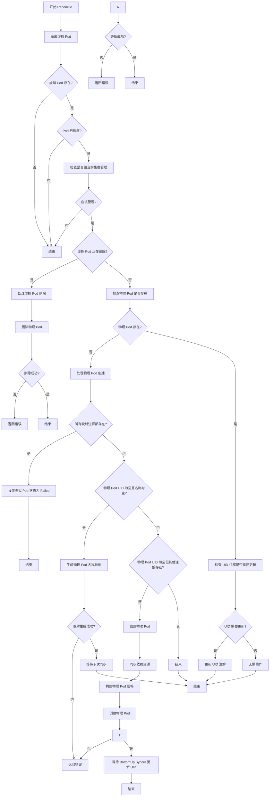
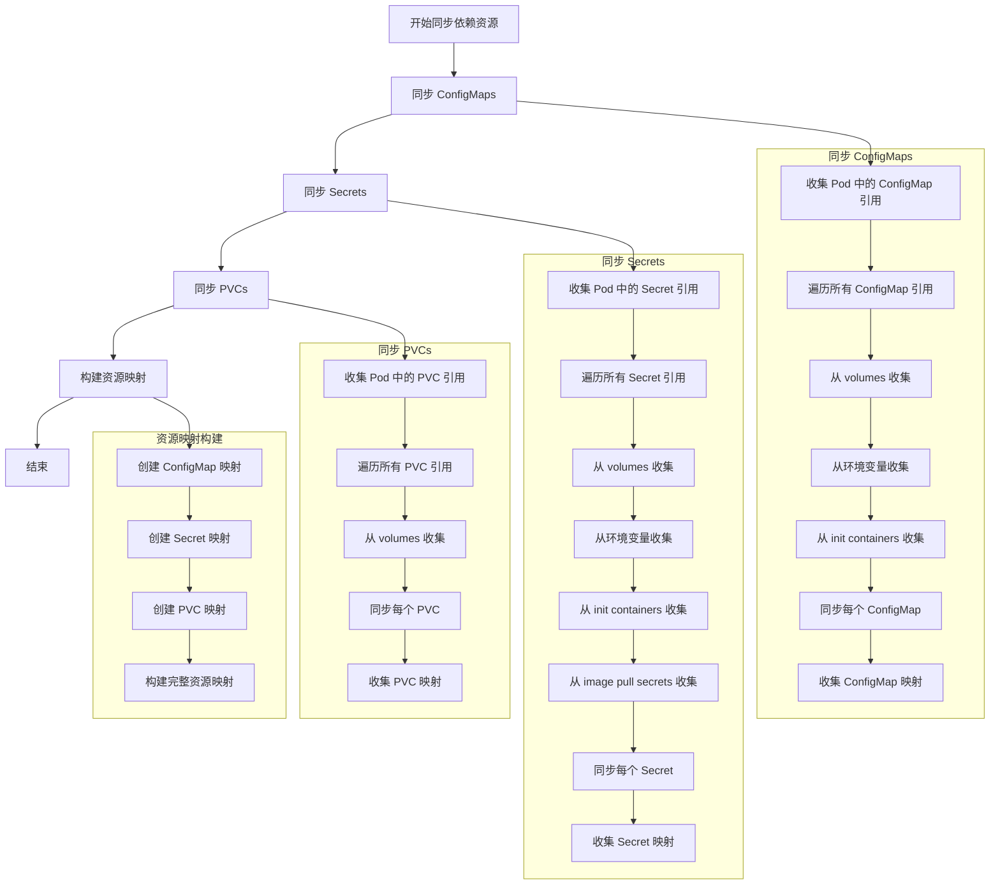
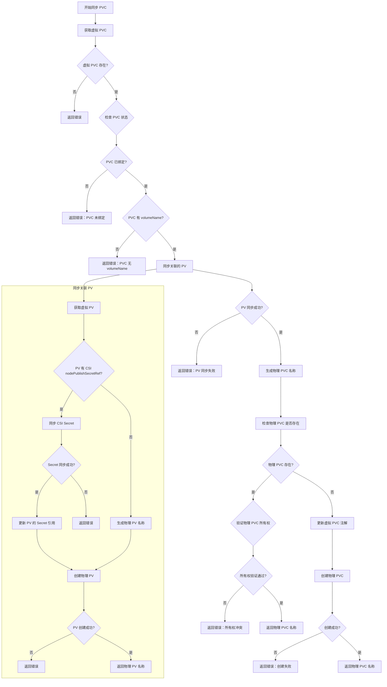
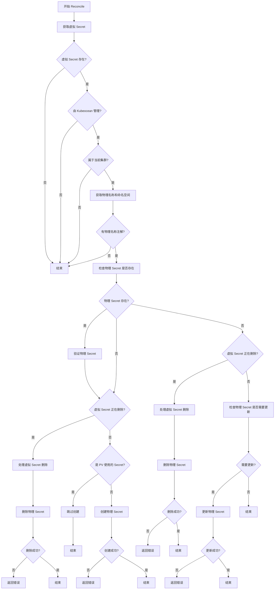

# TopDown Syncer 模块文档

## 1. 模块概述

TopDown Syncer 是 Kubeocean 系统的核心组件之一，负责将虚拟集群中的资源同步到物理集群。它实现了从虚拟集群到物理集群的向下同步（Top-down synchronization），确保虚拟集群中创建的资源能够正确地映射和部署到物理集群中。

### 主要职责和功能

- **资源同步**: 监听虚拟集群中的资源变化，将虚拟资源同步到物理集群
- **状态管理**: 维护虚拟资源与物理资源之间的映射关系
- **生命周期管理**: 处理虚拟资源的创建、更新和删除操作
- **跨集群协调**: 在虚拟集群和物理集群之间建立资源映射关系
- **注解管理**: 通过注解机制维护资源间的关联关系

## 2. 包含的子模块及相关介绍

### 2.1 VirtualPodReconciler

**职责**: 负责虚拟 Pod 的同步管理，将虚拟集群中的 Pod 映射到物理集群。

**主要功能**:
- 监听虚拟集群中的 Pod 变化
- 验证 Pod 是否应该由当前集群绑定管理
- 创建、更新和删除物理 Pod
- 维护虚拟 Pod 与物理 Pod 之间的映射关系
- 处理 Pod 状态同步和生命周期管理

### 2.2 VirtualConfigMapReconciler

**职责**: 负责虚拟 ConfigMap 的同步管理，将虚拟集群中的 ConfigMap 映射到物理集群。

**主要功能**:
- 监听虚拟集群中的 ConfigMap 变化
- 验证 ConfigMap 是否应该由当前集群绑定管理
- 创建、更新和删除物理 ConfigMap
- 维护虚拟 ConfigMap 与物理 ConfigMap 之间的映射关系

### 2.3 VirtualSecretReconciler

**职责**: 负责虚拟 Secret 的同步管理，将虚拟集群中的 Secret 映射到物理集群。

**主要功能**:
- 监听虚拟集群中的 Secret 变化
- 验证 Secret 是否应该由当前集群绑定管理
- 创建、更新和删除物理 Secret
- 维护虚拟 Secret 与物理 Secret 之间的映射关系
- 处理 Secret 数据的同步和验证

### 2.4 VirtualPVCReconciler

**职责**: 负责虚拟 PVC（PersistentVolumeClaim）的同步管理，将虚拟集群中的 PVC 映射到物理集群。

**主要功能**:
- 监听虚拟集群中的 PVC 变化
- 验证 PVC 是否应该由当前集群绑定管理
- 创建、更新和删除物理 PVC
- 维护虚拟 PVC 与物理 PVC 之间的映射关系

### 2.5 VirtualPVReconciler

**职责**: 负责虚拟 PV（PersistentVolume）的同步管理，将虚拟集群中的 PV 映射到物理集群。

**主要功能**:
- 监听虚拟集群中的 PV 变化
- 验证 PV 是否应该由当前集群绑定管理
- 创建、更新和删除物理 PV
- 维护虚拟 PV 与物理 PV 之间的映射关系

## 3. VirtualPodReconciler 工作流程

### 3.1 主要工作流程

### 3.2 同步依赖资源流程

### 3.3 同步 PVC 流程

## 4. VirtualSecretReconciler 主要工作流程

## 5. 关键逻辑实现细节说明

### 5.1 资源映射机制

TopDown Syncer 实现了精确的资源映射机制，通过注解、标签、finalizer 和名称映射规则来维护虚拟资源与物理资源之间的映射关系。

#### 5.1.1 Pod 映射机制

**虚拟 Pod 注解**:
- `kubeocean.io/physical-pod-namespace`: 物理 Pod 的命名空间
- `kubeocean.io/physical-pod-name`: 物理 Pod 的名称
- `kubeocean.io/physical-pod-uid`: 物理 Pod 的 UID
- `kubeocean.io/last-sync-time`: 最后同步时间

**物理 Pod 注解**:
- `kubeocean.io/virtual-pod-namespace`: 虚拟 Pod 的命名空间
- `kubeocean.io/virtual-pod-name`: 虚拟 Pod 的名称
- `kubeocean.io/virtual-pod-uid`: 虚拟 Pod 的 UID

**物理 Pod 标签**:
- `kubeocean.io/managed-by`: 设置为 "kubeocean"，标识由 Kubeocean 管理
- 复制虚拟 Pod 的所有标签

#### 5.1.2 依赖资源映射机制

**虚拟资源注解**:
- `kubeocean.io/physical-name`: 物理资源的名称
- `kubeocean.io/physical-namespace`: 物理资源的命名空间

**虚拟资源标签**:
- `kubeocean.io/managed-by`: 设置为 "kubeocean"
- `kubeocean.io/synced-by-{clusterID}`: 标识由特定集群同步
- `kubeocean.io/used-by-pv`: 如果 secret 资源被 PV 使用，设置为 "true"

**物理资源注解**:
- `kubeocean.io/virtual-name`: 虚拟资源的名称
- `kubeocean.io/virtual-namespace`: 虚拟资源的命名空间

**物理资源标签**:
- `kubeocean.io/managed-by`: 设置为 "kubeocean"
- 复制虚拟资源的所有标签

**Finalizer 机制**:
- 虚拟资源: `kubeocean.io/finalizer-{clusterID}` - 确保资源删除时清理物理资源
- 物理资源: 不添加 finalizer，由 Kubernetes 原生机制管理

#### 5.1.3 名称映射规则

**Pod 名称映射**:
- 格式: `podName(前30字符)-md5(podNamespace+"/"+podName)`
- 示例: 虚拟 Pod `my-app` 在 `default` 命名空间 → 物理 Pod `my-app-abc123def456`

**依赖资源名称映射**:
- 格式: `resourceName(前30字符)-md5(resourceNamespace+"/"+resourceName)`
- 适用于 ConfigMap、Secret、PVC、PV 等资源
- 确保名称唯一性和可预测性

**映射规则特点**:
- **唯一性**: 通过 MD5 哈希确保不同命名空间的同名资源映射到不同名称
- **可预测性**: 相同输入总是产生相同输出
- **长度限制**: 符合 Kubernetes 资源名称长度限制（63字符）
- **冲突避免**: 通过命名空间信息避免名称冲突

#### 5.1.4 命名空间映射

**Pod 命名空间映射**:
- 虚拟集群命名空间 → ClusterBinding.Spec.MountNamespace
- 所有 Pod 都映射到物理集群的指定命名空间

**依赖资源命名空间映射**:
- ConfigMap/Secret: 虚拟命名空间 → ClusterBinding.Spec.MountNamespace
- PVC: 虚拟命名空间 → ClusterBinding.Spec.MountNamespace
- PV: 集群级别资源，无命名空间映射
- CSI Secret: 保持原始命名空间（用于 PV 引用）

#### 5.1.5 映射关系维护

**创建时映射**:
1. 生成物理资源名称
2. 更新虚拟资源注解和标签
3. 添加 finalizer
4. 创建物理资源

**更新时映射**:
1. 检查映射关系是否一致
2. 同步资源内容
3. 维护映射注解

**删除时映射**:
1. 通过 finalizer 确保清理物理资源
2. 移除映射注解
3. 删除虚拟资源

### 5.2 状态同步机制

实现了实时的状态同步：

- **监听机制**: 监听虚拟集群中资源的变化事件
- **验证机制**: 验证资源是否应该由当前集群绑定管理
- **同步策略**: 根据资源类型采用不同的同步策略
- **冲突处理**: 处理虚拟资源与物理资源之间的状态冲突

### 5.3 生命周期管理

实现了完整的资源生命周期管理：

- **创建流程**: 根据虚拟资源创建对应的物理资源
- **更新流程**: 监听虚拟资源变化，同步更新物理资源
- **删除流程**: 处理虚拟资源删除，清理对应的物理资源
- **状态维护**: 维护资源的状态信息和映射关系

