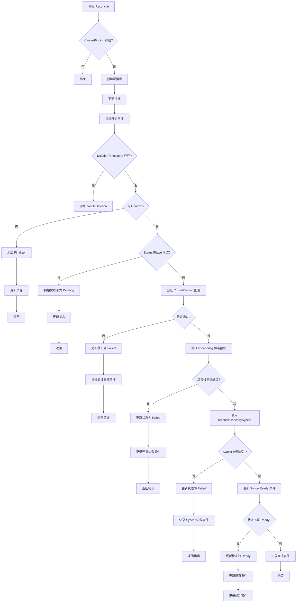
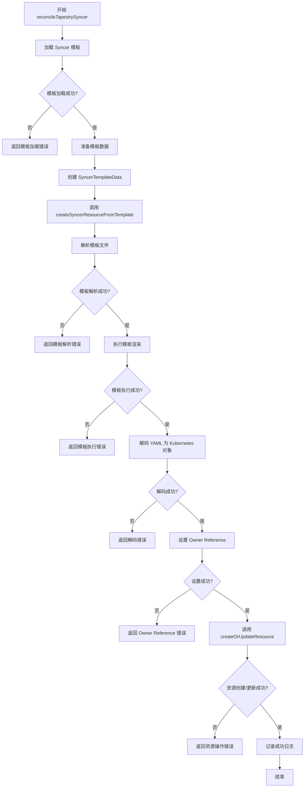
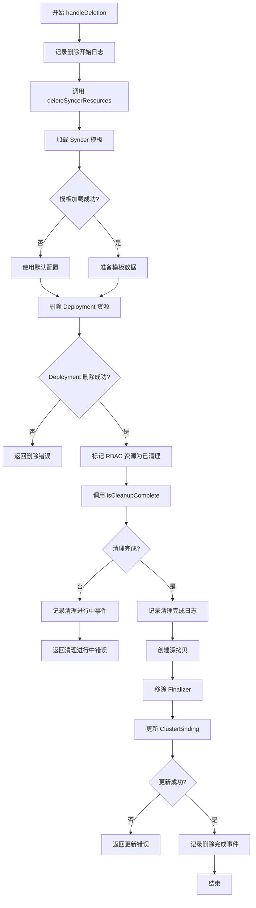

# Tapestry Manager 组件文档

## 1. Tapestry Manager 组件介绍

### 1.1 组件概述

Tapestry Manager 是 Tapestry 系统的中央控制平面组件，负责管理物理集群与虚拟算力集群之间的绑定关系。它是整个系统的核心管理组件，通过 Kubernetes Controller 模式实现集群资源的自动化管理。

### 1.2 主要职责和功能

- **集群绑定管理**: 监听和管理 ClusterBinding 资源的生命周期，包括创建、更新和删除操作
- **Syncer 实例管理**: 为每个 ClusterBinding 自动创建和管理对应的 Tapestry Syncer 实例，包括 Deployment 的自动化部署
- **连接性验证**: 验证物理集群的连接性和权限，检查 kubeconfig 的有效性和目标集群的可达性
- **状态管理**: 维护 ClusterBinding 的详细状态和条件，实时监控和更新状态信息
- **资源清理**: 处理 ClusterBinding 删除时的资源清理工作，确保资源的完整清理
- **事件记录**: 记录所有重要操作的 Kubernetes 事件，提供操作审计和故障排查
- **指标收集**: 提供 Prometheus 指标用于监控和告警，支持系统性能监控

### 1.4 部署方式

- **多副本部署**: 支持多副本部署以确保高可用性
- **Leader Election**: 通过 Kubernetes Lease 资源实现 Leader Election 机制
- **优雅关闭**: 支持优雅的启动和关闭流程
- **健康检查**: 提供存活探针和就绪探针

## 2. 核心模块 ClusterBindingReconciler

### 2.1 模块概述

ClusterBindingReconciler 是 Tapestry Manager 的核心控制器，负责处理 ClusterBinding 资源的完整生命周期管理。它实现了 Kubernetes Controller 模式，通过 watch 机制监听 ClusterBinding 资源的变化并执行相应的协调操作。

### 2.2 主要职责和功能

- **资源协调**: 确保 ClusterBinding 的期望状态与实际状态一致，处理资源的创建、更新和删除
- **验证检查**: 验证 ClusterBinding 配置的有效性和完整性，包括必填字段和格式验证
- **连接测试**: 测试与目标物理集群的连接性，验证 kubeconfig Secret 的存在性和有效性
- **Syncer 管理**: 创建、更新和管理 Tapestry Syncer 实例，使用模板渲染 Kubernetes 资源
- **状态更新**: 维护 ClusterBinding 的状态和条件信息，实时反映资源状态
- **资源清理**: 处理 ClusterBinding 删除时的清理工作，确保资源的完整清理
- **事件记录**: 记录所有操作的关键事件，提供操作审计和故障排查

## 3. ClusterBindingReconciler 主要工作流程

## 4. reconcileTapestrySyncer 主要工作流程

## 5. handleDeletion 主要工作流程

## 6. 实现细节说明

### 6.1 配置验证机制

ClusterBindingReconciler 实现了严格的配置验证机制，确保 ClusterBinding 资源的配置完整性和有效性。验证过程包括：

- **ClusterID 验证**: 检查集群标识符是否为空，确保每个集群绑定都有唯一的标识
- **SecretRef 验证**: 验证 kubeconfig Secret 的引用信息，包括名称和命名空间
- **MountNamespace 验证**: 确保挂载命名空间已指定，这是资源同步的必要配置
- **ServiceNamespaces 验证**: 检查服务命名空间列表中的每个元素是否为空字符串

验证失败时会立即返回错误，并更新 ClusterBinding 的状态为 Failed，同时记录相应的错误事件。

### 6.2 连接性测试机制

实现了完整的集群连接性测试机制，确保能够成功连接到目标物理集群：

- **kubeconfig 读取**: 从指定的 Secret 中安全读取 kubeconfig 数据
- **格式验证**: 验证 kubeconfig 的格式是否正确，确保能够解析为有效的配置
- **连接测试**: 创建 Kubernetes 客户端并测试与目标集群的 API 连接
- **权限验证**: 尝试执行基本的 API 操作来验证权限是否足够
- **超时控制**: 设置 30 秒的连接超时，避免长时间阻塞

连接性测试失败时会记录详细的错误信息，帮助用户快速定位网络或权限问题。

### 6.3 模板渲染机制

使用 Go 模板引擎实现 Kubernetes 资源的动态创建，提供了灵活且安全的资源管理方式：

- **模板加载**: 从文件系统加载预定义的 Kubernetes 资源模板
- **数据准备**: 根据 ClusterBinding 配置准备模板渲染所需的数据
- **模板解析**: 使用 Go 的 template 包解析模板文件
- **动态渲染**: 将配置数据注入模板，生成最终的 YAML 内容
- **对象解码**: 将渲染后的 YAML 解码为 Kubernetes 对象
- **所有权设置**: 为创建的资源设置 Owner Reference，建立资源间的依赖关系

这种机制确保了资源创建的一致性和可维护性，同时支持灵活的配置定制。

### 6.4 资源清理机制

实现了智能的资源清理策略，确保 ClusterBinding 删除时能够正确清理相关资源：

- **选择性清理**: 只删除 Deployment 资源，保留 RBAC 资源以便复用
- **回退机制**: 支持多种命名模式的资源查找和删除
- **状态跟踪**: 跟踪每个资源的清理状态，确保所有资源都被正确处理
- **优雅处理**: 处理资源不存在的情况，避免因资源已删除而报错
- **完成检查**: 验证所有需要清理的资源是否都已成功删除

这种清理策略既确保了资源的完整清理，又避免了不必要的资源删除，提高了系统的稳定性。

这些实现细节确保了 Tapestry Manager 的可靠性、安全性和可维护性，为整个 Tapestry 系统提供了坚实的管理基础。
