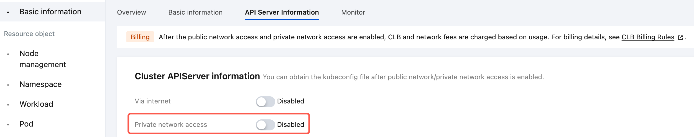

# Kubeocean One-Click Deployment Playbook

> English | [中文](README_zh.md)

This directory provides one-click deployment scripts for Kubeocean components and cluster binding, supporting a one-stop experience of Kubeocean-related features on TKE clusters.

## Features

- Deploy Kubeocean components on compute clusters and worker clusters
- Bind worker clusters to compute clusters and configure simple resource leasing policies

## Prerequisites (Environment Requirements)

- At least one Kubernetes cluster is required as a virtual compute cluster, and another Kubernetes cluster as a worker cluster
- Pod network and node network are directly interconnected between compute cluster and worker cluster
- Can access clusters using `kubectl`
- Local environment has `helm` installed with version v3
- Both clusters have APIServer internal network access enabled, i.e., there is a service named `kubernetes-intranet` with type `LoadBalancer` in the `default` namespace. For TKE standard clusters, refer to the following image to enable it in the cluster console:

- Other requirements refer to: [Requirements](../../docs/requirements.md)

## Basic Usage

### Install and Bind
```bash
# Switch kubectl to worker cluster
bash install-worker.sh
# Add label to nodes that need resource extraction
kubectl label node <nodeName1> role=worker

# Switch kubectl to compute cluster, and copy the generated /tmp/kubeconfig-worker to local
bash install-manager.sh
```
*Note: Script execution order cannot be changed*

### Uninstall
```bash
# Switch kubectl to compute cluster
bash uninstall-manager.sh

# Switch kubectl to worker cluster
bash uninstall-worker.sh
```
*Note: Script execution order cannot be changed*

## Advanced Usage

### Install and Bind
```bash
# Specify output path for worker kubeconfig
bash install-worker.sh -o /tmp/my-kubeconfig
bash install-worker.sh --output /tmp/my-kubeconfig

# Skip ResourceLeasingPolicy deployment
bash install-worker.sh --skip-rlp

# Install manager with specified worker cluster ID and name
bash install-manager.sh -i cls-prod -n prod-cluster
bash install-manager.sh --cluster-id cls-prod --cluster-name prod-cluster

# Install manager with specified worker kubeconfig input path
bash install-manager.sh -w /tmp/kubeconfig-worker1
bash install-manager.sh --worker-kubeconfig /tmp/kubeconfig-worker1

# Only bind cluster, skip manager installation, and specify cluster ID and name
bash install-manager.sh -i cls-prod -n prod-cluster --skip-manager
```

### Uninstall
```bash
# Unbind specific worker cluster by name
bash uninstall-manager.sh -n worker1
bash uninstall-manager.sh --cluster-name worker1

# Only unbind worker cluster without uninstalling manager components
bash uninstall-manager.sh -n worker1 --skip-manager

# Uninstall and clean up specific RLP object by name
bash uninstall-worker.sh -r my-policy
bash uninstall-worker.sh --rlp-name my-policy
```
